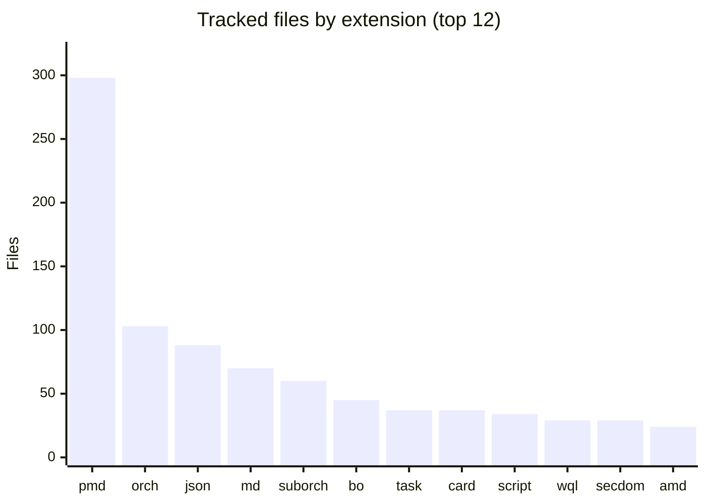
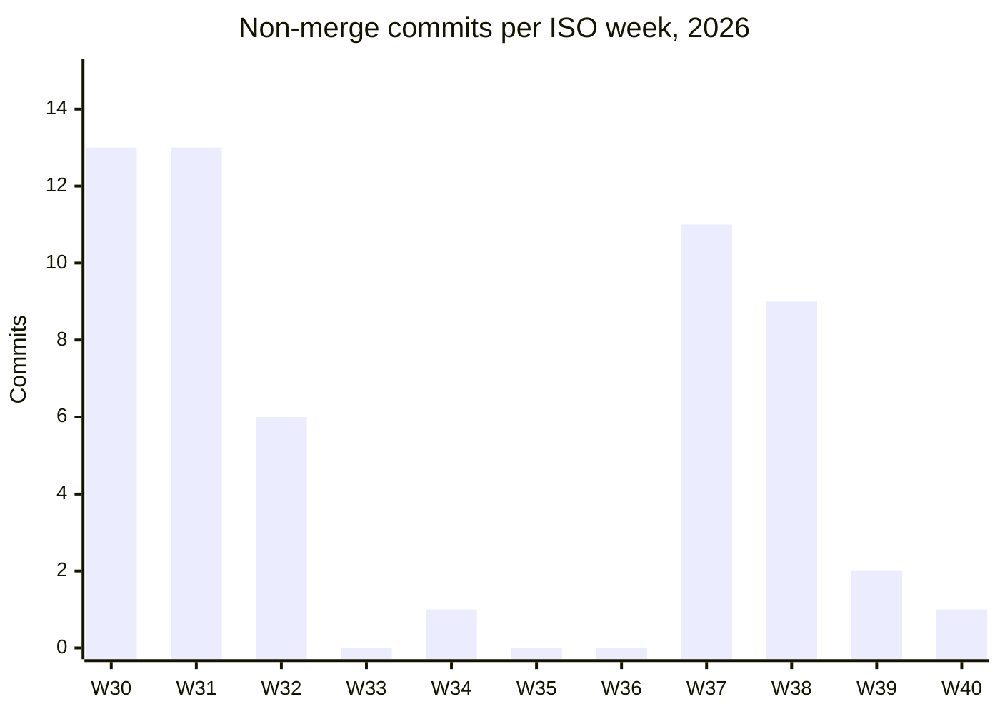

# By the numbers

Data collected on 2026-10-04 from `main` at commit `8b3e7c7`.

## Size

| Measure | Value |
| --- | --- |
| Tracked files | 1,021 |
| Entries (folders with `example.json`) | 46, plus `examples/_template/` |
| Catalog entries | 32 |
| Community examples | 14 |
| Files under `catalog/` | 905 (89% of the repo) |
| Files under `examples/` | 64 |
| Bytes under `catalog/` | about 26.3 MB, of which 18.6 MB is one demo video |
| Hub tooling (`scripts/`, 12 files) | 1,735 lines |
| Gallery source (`site/`, excluding the lockfile) | 867 lines |
| GitHub workflows (4 files) | 242 lines |
| `docs/EXAMPLE_BEST_PRACTICES.md` | 1,769 lines, 70 rule headings |
| Packages in `site/package-lock.json` | 440 |

The repo is mostly exported Workday artifacts. The hand-written tooling that runs the hub (validator, scaffolders, audit, gallery, workflows) is under 3,000 lines in total.

## Files by type

`orch` is `.orchestration`, `suborch` is `.suborchestration`, `bo` is `.businessobject`, `wql` is `.wqlquery`, and `secdom` is `.securitydomain`. Further down the list: 24 `.smd`, 16 `.pod`, 15 `.attachment`, 11 `.mjs`, 11 `.graphquery`, 9 `.businessprocess`, 9 `.astro`, 8 `.properties`, 8 `.mock_response`, 8 `.carddefinition`, 7 `.report`, and 4 `.cardtenantsetting`.

## Entries

| Breakdown | Counts |
| --- | --- |
| By type | Extend App 19, Agent Skill 10, Integration App 7, Reference 7, Orchestration 3 |
| By source badge | Workday 33, Community 13 |
| With a tutorial link | 21 |
| With at least one orchestration | 23 (20 catalog, 3 examples) |

Largest entries by file count: `catalog/capitalProjectPlanning/` (115), `catalog/pmdWidgetDictionary/` (97), `catalog/orchestrationToolkit/` (67), `catalog/employeeRelationsIncidentManagement/` (59), and `catalog/workFromAlmostAnywhere/` (51). The smallest integration apps have 4 files each.

## Orchestrations

| Measure | Value |
| --- | --- |
| Orchestration files | 163 (103 main, 60 sub) |
| Total size | about 4.9 MB, every file a single line of JSON |
| Flow types | FlowSync 67, FlowSubflow 60, IntegrationFrameworkTrigger 31, FlowBusinessProcessTriggered 3, FlowAsync 1, Mixed 1 |
| Most common `flowVersion` | 3.0.0 (69 files); range 2.4.0 to 3.3.0 |
| Largest | `catalog/prismAndExtendDesignPatterns/orchestration/install.orchestration`, 560 KB |

## Presentation files

Of 298 PMD files, 135 do not parse as strict JSON (Workday's format allows script blocks and comments that strict parsers reject), and 90 declare `securityDomains`. The longest PMD is `catalog/capitalProjectPlanning/presentation/ApplicationConfigEdit.pmd` at 1,440 lines.

## Audit baseline

Running the hub rules over every entry (`node scripts/audit-examples.mjs --all --hub-only`) at this commit reports 95 ACTION and 6 ADVICE findings after severity policy, almost all of them from older entries that predate the rules. `HubReadmeSectionsRule` accounts for 66 of the raw findings and `HubFolderKebabCaseRule` for 30. Arcane Auditor's configuration enables 48 rules.

## Average file size by area

Text files only (images, video, PDFs, zips, and the lockfile excluded).

| Area | Files | Lines | Average lines per file |
| --- | --- | --- | --- |
| `scripts/` | 12 | 1,735 | 144 |
| `site/src/` | 12 | 689 | 57 |
| `site/scripts/` | 1 | 76 | 76 |
| `.github/workflows/` | 4 | 242 | 60 |
| `catalog/` | 897 | 65,442 | 72 |
| `examples/` | 64 | 1,515 | 23 |

Line counts understate the catalog: its 163 orchestration files hold 4.9 MB in 163 lines.

## History

| Measure | Value |
| --- | --- |
| Commits on `main` | 72 (56 excluding merges) |
| First commit | 2026-07-22 |
| Last upstream commit | 2026-10-01 |
| Upstream contributors | 5 |
| Unmerged side branches | 3 |

The chart counts non-merge commits. The single W40 commit is the `hl-factory` import, not upstream work.

Work came in two bursts: the hub's structure in late July, and the audit pipeline plus new examples in mid September. The Aug 5 commit that brought in 31 catalog apps added 863 files at once.

## AI-attributed commits

3 of the 56 non-merge commits (about 5%) carry an AI co-author trailer: two with `Co-Authored-By: Claude Sonnet 5` (`bfdd519`, the stock notifications example, and `86dbd3e`, the catalog import) and one with `Co-authored-by: Cursor` (`c96d5d4`, the AP e-invoice audit fixes). No commits come from bot accounts. This is a lower bound, since inline AI tools leave no trace in git history.

## Churn hotspots

The most frequently changed files are `README.md` (22 commits), `CONTRIBUTING.md` (8), `site/src/pages/index.astro` (7), `site/src/pages/examples/[id].astro` (6), `scripts/validate-examples.mjs` (6), and `.github/workflows/deploy-gallery.yml` (6).
