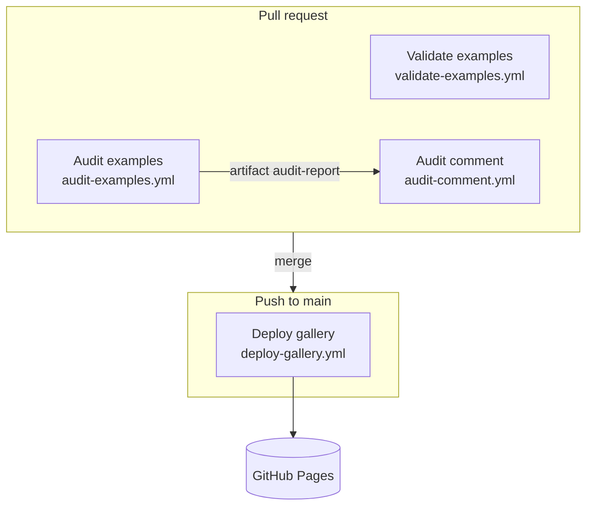

# Deployment

Two different things get "deployed" from this repo. The hub itself deploys one artifact: the static gallery site on GitHub Pages. The entries are deployed by their readers, into their own Workday tenants, by following each README. This page covers both, plus the CI that gates merges.

## CI and CD at a glance

| Workflow | Trigger | Permissions | Job |
| --- | --- | --- | --- |
| `.github/workflows/validate-examples.yml` | Every `pull_request` | default | `node scripts/validate-examples.mjs --check` |
| `.github/workflows/audit-examples.yml` | Every `pull_request`, `workflow_dispatch` with `dirs` | `contents: read` | Find changed folders, run the pinned Arcane action, merge with hub rules, upload `audit/` as `audit-report` (7-day retention) |
| `.github/workflows/audit-comment.yml` | `workflow_run` of "Audit examples" | `contents: read`, `actions: read`, `pull-requests: write` | Download the artifact and post the summary and inline comments |
| `.github/workflows/deploy-gallery.yml` | Push to `main` touching `catalog/**`, `examples/**`, `site/**`, or `hub.config.json`; `workflow_dispatch` | `contents: read`, `pages: write`, `id-token: write` | Build `site/` and deploy to Pages |

All four use Node 20 on `ubuntu-latest`. Validate and Audit run on every pull request, not only ones that touch entries, because both are required checks on `main` (commit `b7f994a`). A required check that never runs leaves a PR unmergeable.

## Gallery deployment

`.github/workflows/deploy-gallery.yml`:

1. Checks out the repo and sets up Node 20 with the npm cache keyed on `site/package-lock.json`.
2. Runs `npm ci` and `npm run build` in `site/`. The `prebuild` hook runs `site/scripts/build-zips.mjs` first, which zips every entry into `site/public/downloads/`, so the zips ship inside `site/dist/`.
3. Uploads `site/dist` with `actions/upload-pages-artifact@v5`, named `github-pages-<run_attempt>` so a re-run does not collide with the previous attempt's artifact.
4. Deploys with `actions/deploy-pages@v5` and a 20-minute timeout (`1200000` ms), since Pages processing can exceed the 10-minute default.

`concurrency: pages` with `cancel-in-progress: true` means a newer merge cancels an in-flight deploy.

The site's URL and base path come from `pagesUrl` in `hub.config.json`. `site/astro.config.mjs` sets `site` to the URL's origin and `base` to its path. The workflow comment lists one manual prerequisite: enable GitHub Pages in the repo settings with "GitHub Actions" as the source.

### Deploying this fork

`hub.config.json` still says `https://workday.github.io/WorkdayDeveloperProgram`. For the gallery of `hl-factory/workday-demo` to work on its own Pages site, change `org`, `repo`, `repoUrl`, and `pagesUrl`. Otherwise the build succeeds but asset paths use `/WorkdayDeveloperProgram/` as the base, and every "browse this snapshot" link in `SOURCE.md` points at the upstream repo. The issue template contact links in `.github/ISSUE_TEMPLATE/config.yml` and the best-practices link in `.github/PULL_REQUEST_TEMPLATE.md` are hardcoded to the upstream repo too.

## Audit workflow details

The audit job runs Arcane through its GitHub Action, pinned by commit (`Ekwuno/ArcaneAuditor@c31316d1...`, Arcane CLI v2.0.0). The action verifies the CLI download by sha256. It is told not to annotate or fail (`annotate: "false"`, `fail-on: none`) because the next step merges Arcane and hub findings and applies the hub's own policy. Concurrency is per PR with cancellation, so pushing again cancels the previous audit.

`AUDIT_MODE` is resolved in this order: `advisory` if the PR has the `audit-override` label, else the repository variable `AUDIT_MODE`, else `enforcing`.

The comment workflow is split out for security, described in [Security](security.md).

## Deploying an entry to a tenant

The hub has no deployment tooling for Workday artifacts. Readers follow the entry's README:

- **Extend apps**: deploy the folder to a Workday development tenant with App Builder, the IDE plugins, or the WDCLI. Most catalog READMEs describe "Create Copy" from the Developer Site as the recommended path and a manual deploy as the alternative.
- **Orchestrations and integration apps**: import into Orchestration Builder, configure an Integration System and security, and deploy.
- **Agent skills**: copy the markdown into an agent's skills directory.
- **AP e-invoice**: unzip `catalog/ap-einvoice/apeinvoice.zip` and run `catalog/ap-einvoice/scripts/updateAppid.sh` (or `.ps1`) to replace the app reference id before deploying.

The "Before you deploy" README section exists for this step: it lists the app reference ids, base URLs, WIDs, security domains, and dates the reader must change. See [Extend app anatomy](primitives/extend-app-anatomy.md) and [Integration apps](catalog/integration-apps.md).

## Related pages

- [Gallery](systems/gallery.md)
- [Audit pipeline](systems/audit/index.md)
- [Configuration](reference/configuration.md)
