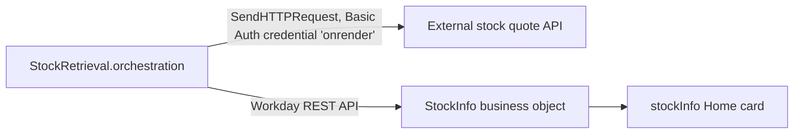

# Extend examples

Active contributors: tony-gilfillan, srivilliamsai

## Purpose

Two community examples are complete, small Workday Extend apps built around a Workday Home card. They are the smallest working Extend apps in the repo (9 and 12 files) and a good place to see how an app shell, a business object, an orchestration, and a card fit together before opening a large catalog app. The file types are explained in [Extend app anatomy](../primitives/extend-app-anatomy.md).

## Stock Notifications

`examples/stock-notifications/` by tony-gilfillan, added Jul 31 2026 (PR #3, commit `bfdd519`).

```text
examples/stock-notifications/
├── appManifest.json
├── cards/stockInfo.carddefinition          # Home card showing the price
├── model/StockInfo.businessobject          # ticker, price, last updated
├── model/StockSecurityDomain.securitydomain
├── orchestration/StockRetrieval.orchestration
└── presentation/stocknotifications_svfbfp.amd, .smd
```



The orchestration fetches the WDAY quote from an external API and writes it into the `StockInfo` business object. The card reads from that object. There are no PMD pages.

Before deploying, readers must change three things the README calls out or the audit flags:

- The `SendHTTPRequest` URL points at a specific external host (`https://stockinfo-a6k3.onrender.com/api/stock`); replace it with your own quote API.
- The Basic Auth credential `onrender` has placeholder `YOUR_USERNAME` / `YOUR_PASSWORD` values.
- The AMD and SMD are named with the original tenant's app reference id, `stocknotifications_svfbfp`. `HubAppReferenceIdRule` flags both files because the README has no "Before you deploy" section.

## Peer Kudos and Recognition Card

`examples/peer-kudos-home-card/` by srivilliamsai, added Sep 21 2026 (PR #16, commit `2f09378`).

```text
examples/peer-kudos-home-card/
├── appManifest.json
├── cards/kudosSpotlight.carddefinition     # inlineCard / cardHeader / simpleCard
├── model/PeerKudos.businessobject          # recipient, sender, badge, message, timestamp
├── model/KudosSecurityDomain.securitydomain
├── orchestration/KudosNotification.orchestration
├── presentation/peerKudos.amd, peerKudos.smd
├── presentation/home.pmd                   # recent shoutouts
├── presentation/sendKudos.pmd              # pick a peer, a value badge, a note
└── sample-data/sample-kudos-entry.json
```

Employees submit kudos on `examples/peer-kudos-home-card/presentation/sendKudos.pmd`, which stores a `PeerKudos` record. `KudosNotification` queries recent kudos and prepares manager notification summaries. The `kudosSpotlight` card links into the flow from Workday Home.

This example follows the current README format fully, including a "Before you deploy" section that covers the app reference id (`peerKudos`, a plain id rather than a tenant-suffixed one), security domain mapping, base URLs via `baseUrlType`, and the notification recipient. It passes every hub rule.

## Comparing the two

| | Stock Notifications | Peer Kudos |
| --- | --- | --- |
| Files | 9 | 12 |
| Pages | 0 | 2 |
| Data source | External HTTP API | User input |
| App reference id | `stocknotifications_svfbfp` (tenant-suffixed) | `peerKudos` |
| "Before you deploy" | Missing (ADVICE) | Present |

## Key source files

| File | Purpose |
| --- | --- |
| `examples/stock-notifications/orchestration/StockRetrieval.orchestration` | External fetch and business object write |
| `examples/stock-notifications/cards/stockInfo.carddefinition` | Home card |
| `examples/peer-kudos-home-card/presentation/sendKudos.pmd` | Submission form |
| `examples/peer-kudos-home-card/cards/kudosSpotlight.carddefinition` | Home card |
| `examples/peer-kudos-home-card/orchestration/KudosNotification.orchestration` | Manager notification flow |

## Related pages

- [Workday agent skills](workday-agent-skills.md), especially `workday-home-cards`
- [Catalog](../catalog/index.md) for larger Extend apps
