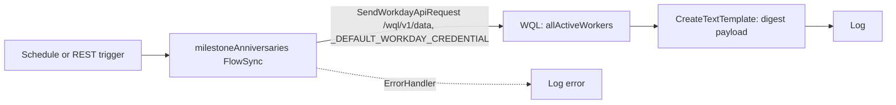

# Orchestrations

Active contributors: srivilliamsai, obinnacodes

## Purpose

Two community entries have the Orchestration type. `examples/wql-anniversary-celebrations/` is a working flow that runs a WQL query and formats a celebration digest. `examples/employee-data-orchestration/` is a placeholder that points at an official tutorial. The third Orchestration entry, `catalog/createSpotBonus/`, lives in the catalog. For the file format, see [Orchestration files](../primitives/orchestration-files.md).

## WQL milestone celebrations

`examples/wql-anniversary-celebrations/` by srivilliamsai, added Sep 14 2026 (PR #14, commit `c935e87`).

```text
examples/wql-anniversary-celebrations/
├── orchestration/milestoneAnniversaries.orchestration   # .maya.FlowSync
├── wql/anniversaries.wql                 # commented, readable query
├── wql/milestoneAnniversaries.wqlquery   # same query as an id/parameters/query/limit file
├── sample-data/sample-wql-response.json  # fictional workers
└── sample-data/sample-webhook-payload.json   # Slack Block Kit style digest
```



The flow has one `SendWorkdayApiRequest` step, two `CreateTextTemplate` steps, two `Log` steps, and two `ErrorHandler`s. It uses a `WorkdayCredentialRef` rather than any literal credential.

Things to know before using it:

- The query selects every active worker with a hire date (`WHERE hireDate IS NOT NULL ORDER BY hireDate ASC`) and does not itself filter to 1, 5, 10, 15, or 20 years. The README's "Before you deploy" section tells adopters to adjust the date logic for their cadence.
- The `.wqlquery` file sets `"limit": "100"`, so large organizations need paging.
- Sending the digest to Slack or Teams is left to the adopter. The README says to add an Outbound HTTP step and read the webhook URL from tenant configuration, never hardcode it.

The README is the most complete in `examples/`, with all four hub sections including "Before you deploy".

## Get and Create Employee Data (placeholder)

`examples/employee-data-orchestration/` by obinnacodes, added Jul 22 2026 as one of the first three examples (`50a7c33`).

```text
examples/employee-data-orchestration/
├── README.md
├── example.json                     # tutorial: https://developer.workday.com/doc/mxj1630014392721.md, source: workday
└── orchestration/PLACEHOLDER.md     # "Orchestration definition goes here"
```

There is no flow file yet. The README says so ("Status: this is a sample entry that demonstrates the hub's format") and the gallery's Tutorial button links to the official "Get and Create Workday Employee Data" walkthrough. It is the only entry in `examples/` with `"source": "workday"`, so it shows a Workday badge even though it sits in the community section, and it is the only entry in `examples/` with a `tutorial` link (20 catalog entries have one). The download zip for it contains only the README, the placeholder, and `SOURCE.md`.

Its README has no "Before you deploy" section, which is an ADVICE finding.

## Key source files

| File | Purpose |
| --- | --- |
| `examples/wql-anniversary-celebrations/orchestration/milestoneAnniversaries.orchestration` | The flow |
| `examples/wql-anniversary-celebrations/wql/milestoneAnniversaries.wqlquery` | Query definition |
| `examples/wql-anniversary-celebrations/README.md` | Step-by-step setup and deploy notes |
| `examples/employee-data-orchestration/example.json` | Tutorial link and Workday source |
| `examples/employee-data-orchestration/orchestration/PLACEHOLDER.md` | Placeholder |

## Related pages

- [Workday agent skills](workday-agent-skills.md), especially `workday-orchestrate` and `workday-apis`
- [Source badges and support](../features/source-badges-and-support.md)
