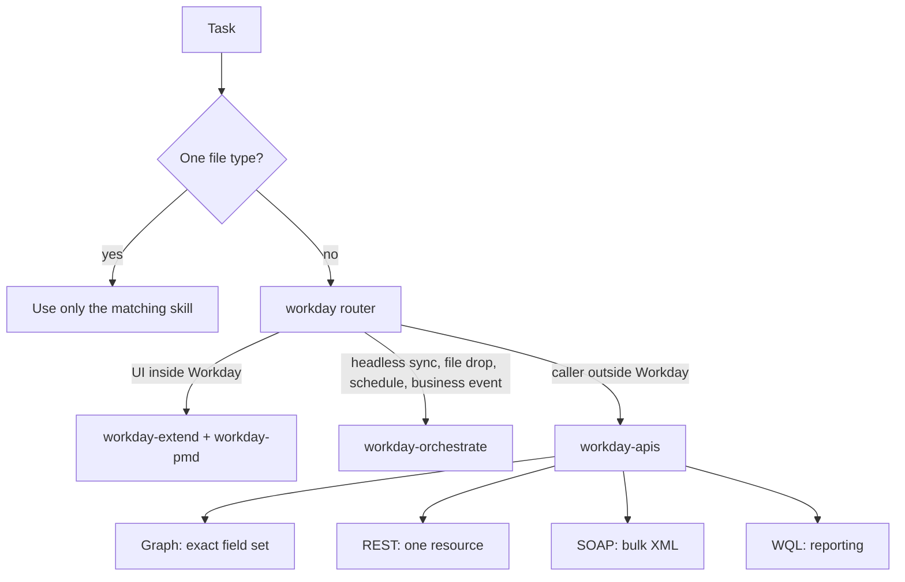

# Workday agent skills

Active contributors: srivilliamsai

## Purpose

Eight community examples form one suite of markdown agent skills for Workday developers. One router skill decides which artifact skill applies, and seven artifact skills each review or write one kind of Workday file. Every skill points the agent at a specific folder in `catalog/` as the reference to copy from, so the catalog doubles as the skills' ground truth. The suite was added in PR #17 (commit `2cddd08`, Sep 22 2026, merged Oct 1).

## Directory layout

Each skill folder has the same three files:

```text
examples/workday-pmd-skill/
├── SKILL.md       # frontmatter (name, description) + rules + output format + test questions
├── README.md      # What it is / What's inside / How to use it / Before you deploy
└── example.json   # type "Agent Skill", author srivilliamsai
```

The `SKILL.md` files are 30 to 46 lines each.

## The skills

| Folder | Skill `name` | Use when editing | Open first |
| --- | --- | --- | --- |
| `examples/workday-skill` | `workday` | A new app, or a change that spans artifact types | Decides; routes to one skill below |
| `examples/workday-extend-skill` | `workday-extend` | `.amd`, `.smd`, `.businessobject`, `.businessprocess`, `.securitydomain`, `.attachment`, `appManifest.json` | `catalog/vehicleRegistration`, `catalog/tuitionReimbursement` |
| `examples/workday-pmd-skill` | `workday-pmd` | `.pmd`, `.script`, chart pages, `.properties` | `catalog/pmdWidgetDictionary`, `catalog/pmdScripting`, `catalog/chartDictionary` |
| `examples/workday-home-cards-skill` | `workday-home-cards` | `.card`, `.carddefinition`, `.cardtenantsetting` | `catalog/employeeRecognition/cards/createRecognitionCard.carddefinition` |
| `examples/workday-orchestrate-skill` | `workday-orchestrate` | `.orchestration`, `.suborchestration` | `catalog/orchestrateForIntegrationsSampler/orchestration/GetWorkers.orchestration` |
| `examples/workday-apis-skill` | `workday-apis` | `.graphquery`, `.wqlquery`, REST, SOAP, OAuth | `catalog/vehicleRegistration/presentation/graphQueries` |
| `examples/workday-ai-gateway-skill` | `workday-ai-gateway` | AI Gateway calls, AWS Translate, Textract, Comprehend, badge flows | `catalog/generateWQL`, `catalog/documentIntelligenceWithTheAIGateway`, `catalog/AWSStarterKit`, `catalog/AWSBadgeGenerator`, `catalog/charitableDonationsWithSentimentAnalysis` |
| `examples/workday-developer-copilot-skill` | `workday-developer-copilot` | Writing a prompt for Workday Developer Copilot | `catalog/generateWQL` |

Each description has a "Do not use for ..." clause naming the neighbouring file types, so an agent picks exactly one skill.

## How the router decides



`examples/workday-skill/SKILL.md` also fixes the folder layout an app must use (`presentation/`, `model/`, `orchestration/`, `cards/` and `attributes/` at the app root) and says "Copy only apps under `catalog/`. Do not invent security domain ids, routes, or endpoints."

## What the rules look like

The artifact skills are short imperative checklists. A sample from `examples/workday-pmd-skill/SKILL.md`:

- Give every page a `securityDomains` entry that matches the business object's `defaultSecurityDomains`.
- Give every widget an `id`.
- List `failOnStatusCodes` for at least 400 and 403 on every endpoint.
- Never leave a `console.*` call in a page or a binding.
- Never write a `*.workday.com` host, client secret, token, or webhook in the page.

Several of these restate Arcane Auditor rules (`WidgetIdRequiredRule`, `EndpointFailOnStatusCodesRule`, `ScriptConsoleLogRule`, `HardcodedWorkdayAPIRule`, `PMDSecurityDomainRule`), so an agent that follows the skill should produce code that passes the [audit](../systems/audit/index.md). Each skill ends with an output format ("state the file and line, name the rule, and show a short before and after") and three test questions.

## Caveats

- The skills hold the catalog to rules that much of the catalog does not meet. For example, only 90 of the 298 PMDs in the repo declare `securityDomains`, and `catalog/vehicleRegistration/presentation/home.pmd` (the PMD skill's suggested "real page") has two `console.info` calls inside bindings (lines 61 and 183).
- `examples/workday-extend-skill/SKILL.md` says to build data providers with `{{apiGatewayEndpoint}}`, while most catalog AMDs use the `<% apiGatewayEndpoint + ... %>` script form. Both appear in the catalog; see [Extend app anatomy](../primitives/extend-app-anatomy.md).
- All `Open first` paths exist at this commit. If a catalog folder is renamed (for example to fix `HubFolderKebabCaseRule`), these skills need updating too.

## Key source files

| File | Purpose |
| --- | --- |
| `examples/workday-skill/SKILL.md` | Router |
| `examples/workday-extend-skill/SKILL.md` | App shell and model rules |
| `examples/workday-pmd-skill/SKILL.md` | Page, script, and chart rules |
| `examples/workday-home-cards-skill/SKILL.md` | Home card rules |
| `examples/workday-orchestrate-skill/SKILL.md` | Maya flow rules |
| `examples/workday-apis-skill/SKILL.md` | Graph, WQL, REST, SOAP rules |
| `examples/workday-ai-gateway-skill/SKILL.md` | AI Gateway and AWS rules |
| `examples/workday-developer-copilot-skill/SKILL.md` | Prompt shaping |

## Related pages

- [Policy skills](policy-skills.md)
- [Catalog](../catalog/index.md)
