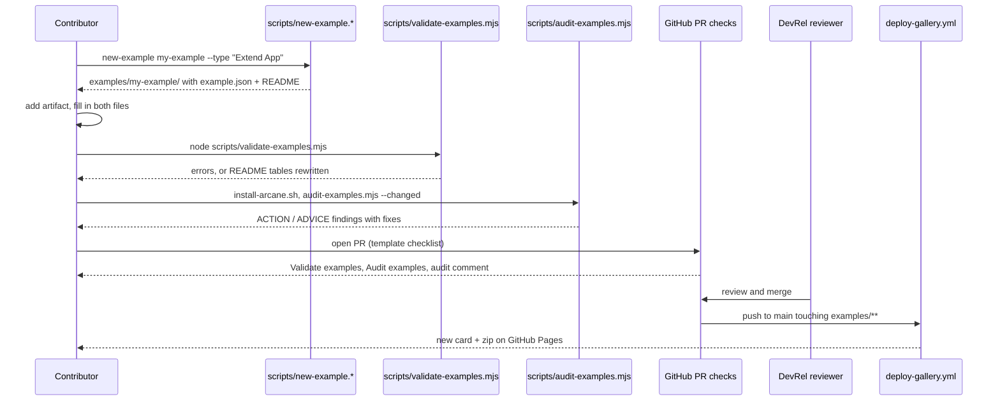

# Contribution flow

Active contributors: ekwuno, srivilliamsai, tony-gilfillan

## Purpose

Adding an example is meant to be low effort: "a folder, two small files, one validation command" (`CONTRIBUTING.md`). This page traces that flow end to end, from scaffolding to a card on the gallery, and names the code that runs at each step.

## The steps



### 1. Fork and scaffold

Contributors fork the repo, branch, and run one of the scaffolders from the repo root. All three produce identical folders ([Scaffolder](../systems/scaffolder.md)):

```bash
node scripts/new-example.mjs your-example-name --type "Extend App"
```

The scaffolder enforces kebab-case, checks the type against `hub.config.json`, copies `examples/_template/`, and sets `title`, `type`, and the README's first heading. It does not set `description`, so the template sentence "One or two sentences about what this example shows." stays until the contributor replaces it. The audit flags it as `HubTemplateBoilerplateRule` if it does not.

Without any tooling, contributors can copy `examples/_template/` by hand, even in the GitHub web UI (`CONTRIBUTING.md`, "Submitting by hand").

### 2. Add the artifact and fill in two files

The folder must be self-contained. Typical artifacts are Extend app source exported with Local Disk Sync, the WDCLI, or a ZIP download, orchestration definitions, or a `SKILL.md`. The README needs four sections: What it is, What's inside, How to use it, and Before you deploy. `example.json` needs `title`, `description`, and `type`; the rest is optional. See [Example entry](../primitives/example-entry.md) and [Template](../examples/template.md).

### 3. Validate

`node scripts/validate-examples.mjs` checks every entry and rewrites the two README index tables. The contributor commits the README change with the example. CI runs the same script with `--check`, which fails on a stale table. A contributor who cannot run Node can add their row by hand or leave the table alone; "CI will flag the stale table, and a reviewer will regenerate it for you during review. That is normal and fine." See [Validator](../systems/validator.md).

### 4. Audit (optional locally, automatic on the PR)

```bash
./scripts/install-arcane.sh
node scripts/audit-examples.mjs --changed
```

The first command downloads Arcane Auditor into `.arcane-auditor/bin/` (gitignored). The second audits each changed folder with Arcane plus the hub rules. `--skip-arcane` runs only the hub rules. See [Audit pipeline](../systems/audit/index.md).

### 5. Open the pull request

`.github/PULL_REQUEST_TEMPLATE.md` asks for a one- or two-sentence summary and a checklist: entry in its own folder, `--check` passes, README has the three things a reader needs, no credentials or real data, and the audit passes or its findings are explained.

Two checks run and post results:

- **Validate examples**: `example.json` and the README index ([Validator](../systems/validator.md))
- **Audit examples**: annotations and a job summary, then a sticky comment and inline suggestions from **Audit comment** ([PR comments](../systems/audit/pr-comments.md))

ACTION findings fail the audit check. ADVICE findings never block. A maintainer can add the `audit-override` label when a finding is wrong for the example.

### 6. Review

Workday DevRel reviews every PR. `CONTRIBUTING.md` lists three criteria: it works (the reviewer follows the README and gets the stated result), it teaches (the README explains why), and it is safe (no secrets, no real data, nothing tenant-specific). The stated response target is "within a few business days."

### 7. Publish

After merge, `.github/workflows/deploy-gallery.yml` runs on any push to `main` that touches `examples/**`. The new entry appears as a card with a Community badge (unless DevRel sets `"source": "workday"`), gets its own page rendered from its README, and gets a zip download. See [Deployment](../deployment.md) and [Example downloads](example-downloads.md).

## Catalog changes go through issues

`catalog/` is not open to outside PRs. `CONTRIBUTING.md` says to open an issue if something belongs there, and `.github/CODEOWNERS` routes any `/catalog/` change to `@Workday/devrel`. Catalog folders also face the stricter audit bar ([Severity policy](../systems/audit/severity-policy.md)).

## Issue templates

| Template | Use | File |
| --- | --- | --- |
| Bug report | An entry does not deploy, import, or run as its README says | `.github/ISSUE_TEMPLATE/bug-report.md` |
| New example proposal | Get feedback before building | `.github/ISSUE_TEMPLATE/new-example-proposal.md` |
| Contact links | Discussions for questions; the support policy | `.github/ISSUE_TEMPLATE/config.yml` |

The bug report template asks for the Workday release, tenant type, entry version, and tools used, which matches the `_Version 2025.1_`-style lines at the top of catalog READMEs.

## Key source files

| File | Purpose |
| --- | --- |
| `CONTRIBUTING.md` | The contributor guide this flow follows |
| `scripts/new-example.mjs` | Node scaffolder |
| `scripts/validate-examples.mjs` | Validation and README table sync |
| `scripts/audit-examples.mjs` | Local and CI audit entry point |
| `.github/PULL_REQUEST_TEMPLATE.md` | PR checklist |
| `.github/workflows/validate-examples.yml` | Required validation check |
| `.github/workflows/audit-examples.yml` | Required audit check |
| `.github/workflows/deploy-gallery.yml` | Publishes the merged entry |

## Related pages

- [Development workflow](../how-to-contribute/development-workflow.md) for changing the tooling itself
- [Pitfalls](../background/pitfalls.md) for common ways a submission trips the checks
