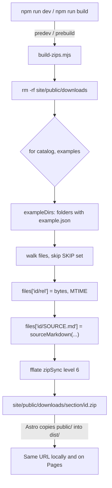

# Example downloads

Active contributors: ekwuno

## Purpose

Every entry can be downloaded on its own as a zip from the gallery, so nobody has to clone the whole repo to use one example. Each zip contains a generated `SOURCE.md` that records the commit it came from and explains how to check out the same folder with git and send changes back. The feature shipped in PR #15 (`make-examples-downloadable`, Sep 2026).

## Directory layout

```text
site/
├── scripts/
│   └── build-zips.mjs        # zips every entry before dev and build
├── src/
│   ├── lib/
│   │   ├── gitTrace.js       # sparse checkout snippet + SOURCE.md text
│   │   └── examples.js       # downloadUrl, downloadName, sparseCheckout helpers
│   └── components/
│       ├── Card.astro        # download icon on each card
│       └── EntryPage.astro   # Download zip button + "Get it with git instead"
└── public/downloads/         # generated output, gitignored
```

## Key abstractions

| Symbol | File | Description |
| --- | --- | --- |
| `exampleDirs(section)` | `site/scripts/build-zips.mjs` | Lists entry folders that have `example.json`, skipping `_` and `.` names |
| `walk(dir)` | `site/scripts/build-zips.mjs` | Sorted recursive file list, skipping the `SKIP` set |
| `SKIP` | `site/scripts/build-zips.mjs` | `.DS_Store`, `.gitkeep`, `example.json`, `node_modules`, `.git` |
| `MTIME` | `site/scripts/build-zips.mjs` | Fixed `2000-01-01T00:00:00Z` timestamp for reproducible bytes |
| `sparseCheckout(example, hub)` | `site/src/lib/gitTrace.js` | Three-line `git clone --filter=blob:none --sparse` + `git sparse-checkout set` snippet |
| `sourceMarkdown(example, hub, { sha, date })` | `site/src/lib/gitTrace.js` | The full `SOURCE.md` text |
| `downloadUrl`, `downloadName` | `site/src/lib/examples.js` | `withBase("downloads/<section>/<id>.zip")` and `<id>.zip` |

## How it works



1. `site/package.json` wires `predev` and `prebuild` to `node scripts/build-zips.mjs`, so zips are always regenerated before the dev server or a build.
2. The script clears `site/public/downloads/`, then for each entry reads every file except the `SKIP` set into an in-memory map keyed `<id>/<relative path>`. The zip therefore unpacks into a single `<id>/` folder. `example.json` is left out because it is hub metadata only.
3. It adds `<id>/SOURCE.md` from `sourceMarkdown()`. The commit comes from `GITHUB_SHA` in CI, otherwise `git rev-parse HEAD`, otherwise `"unknown"`. The date is the last commit's committer date (`git log -1 --format=%cI`), not wall clock.
4. It writes the zip with `fflate`'s `zipSync` at level 6 and logs `build-zips: wrote N zip(s) ...`.

Because all file times are pinned and the date comes from the commit, building the same commit twice yields identical bytes.

## What `SOURCE.md` contains

Generated by `sourceMarkdown()` in `site/src/lib/gitTrace.js`:

- A table with the repository URL, folder path, commit (or "unknown (local build)"), build date, a link to browse that snapshot (`/tree/<sha>/<path>`), and the hub page URL
- "Get the latest version": download again, or run the sparse checkout snippet
- "Contribute a change back": fork, sparse-checkout the fork, copy edited files over the folder, commit, push, open a PR, with a link to `CONTRIBUTING.md`

All URLs come from `hub.config.json`, so in this copy they still point at `Workday/WorkdayDeveloperProgram`.

## Where the buttons are

- **Card** (`site/src/components/Card.astro`): a small download icon in the card header. The title link is stretched over the whole card with `after:inset-0`, and the download link sits above it with `relative z-10` so both stay clickable.
- **Entry page** (`site/src/components/EntryPage.astro`): a "Download zip" primary button next to "View code" and an optional "Tutorial" button, plus a collapsible "Get it with git instead" panel showing `sparseCheckout(example)` with a Copy button.

## Integration points

- Reads `hub.config.json` for `repo`, `repoUrl`, `defaultBranch`, and `pagesUrl`.
- Uses the same folder rules as `site/src/lib/examples.js`; the comment in `site/scripts/build-zips.mjs` calls this out ("Same folder rules as src/lib/examples.js").
- Runs in CI as part of `npm run build` in `.github/workflows/deploy-gallery.yml`, where `GITHUB_SHA` is set. See [Deployment](../deployment.md).
- `site/public/downloads/` is in `.gitignore`. Do not commit it.

## Entry points for modification

To change what goes into a zip, edit `SKIP` or `walk()` in `site/scripts/build-zips.mjs`. To change the text readers see, edit `sourceMarkdown()` in `site/src/lib/gitTrace.js`; the same file feeds the entry page's git snippet, so keep it free of Vite or Astro imports. To move the download URL, change `downloadUrl` in `site/src/lib/examples.js` and the output path in `site/scripts/build-zips.mjs` together.

## Key source files

| File | Purpose |
| --- | --- |
| `site/scripts/build-zips.mjs` | Builds one zip per entry |
| `site/src/lib/gitTrace.js` | Sparse checkout snippet and `SOURCE.md` text |
| `site/src/lib/examples.js` | `downloadUrl`, `downloadName`, `sparseCheckout` |
| `site/src/components/Card.astro` | Card download icon |
| `site/src/components/EntryPage.astro` | Download button and git panel |
| `site/package.json` | `predev` / `prebuild` hooks and the `fflate` dev dependency |

## Related pages

- [Gallery](../systems/gallery.md)
- [Contribution flow](contribution-flow.md)
