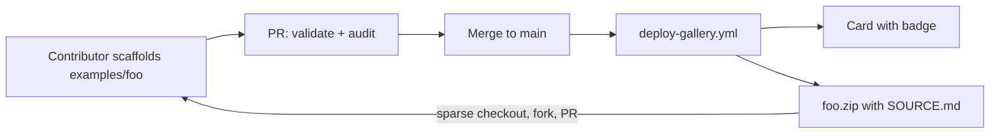

# Features

These pages follow user-visible capabilities across the content, scripts, CI, and gallery. Each one traces a path through several [systems](../systems/index.md) rather than describing one directory.

| Feature | What a user sees | Systems involved |
| --- | --- | --- |
| [Contribution flow](contribution-flow.md) | Scaffold a folder, fill two files, validate, audit, open a PR, see the card on the gallery | Scaffolder, validator, audit, gallery deploy |
| [Example downloads](example-downloads.md) | A Download zip button on every card and entry page, with a `SOURCE.md` that leads back to git | `site/scripts/build-zips.mjs`, `site/src/lib/gitTrace.js`, gallery |
| [Source badges and support](source-badges-and-support.md) | A Workday or Community badge per entry, and a support policy that depends on it | `example.json` `source`, validator, gallery, audit policy, `SUPPORT.md` |

## How the features relate

The download zip closes the loop: its `SOURCE.md` tells the reader how to check out the same folder and send a change back, which starts the contribution flow again.
