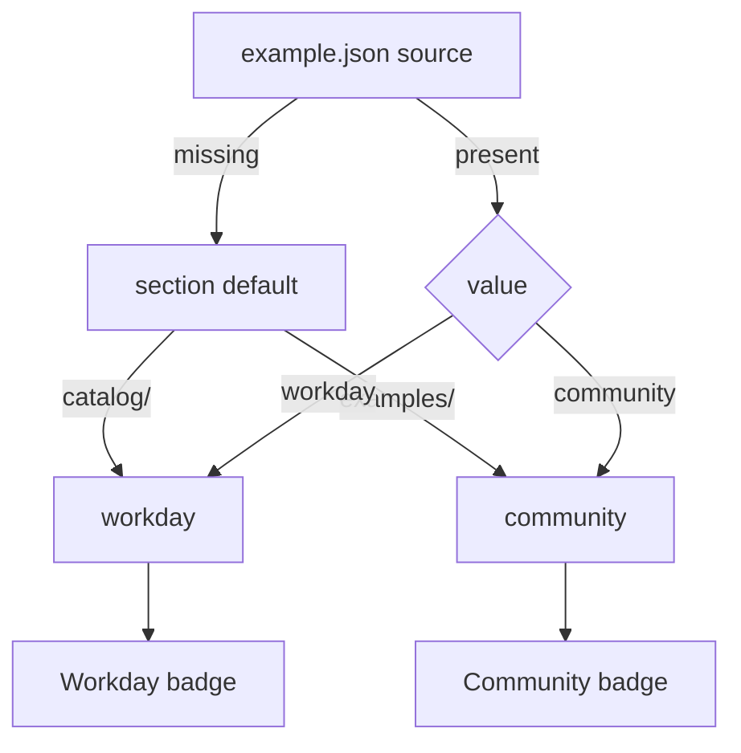

# Source badges and support

Active contributors: ekwuno

## Purpose

Each entry carries a **Workday** or **Community** badge in the gallery. The badge comes from the `source` field in `example.json`, and it decides how the entry is maintained when it breaks (`SUPPORT.md`). The same section split also changes how strictly the audit treats a folder. Introduced in commit `7caccd7` "Label examples as Workday or Community" (Jul 2026).

## How the badge is derived

- `scripts/validate-examples.mjs` defines `defaultSource: "workday"` for `catalog` and `"community"` for `examples`. It rejects any `source` other than `workday` or `community`, and rejects `"source": "community"` inside `catalog/` with the message "catalog apps are Workday-maintained ... Community submissions live in examples/."
- `site/src/lib/examples.js` applies the same defaults when loading entries and exposes `sourceLabel(example)`, which returns `"Workday"` or `"Community"`.
- `site/src/components/Card.astro` and `site/src/components/EntryPage.astro` render a light blue badge with a check-circle icon for Workday and an outlined badge with a people icon for Community. The index page has a Source filter built from `sourcesInUse`.

The template ships with `"source": "community"`, and `examples/_template/README.md` says DevRel sets `workday` on examples authored by Workday teams. In the current tree, one community-section entry is marked Workday: `examples/employee-data-orchestration/example.json`.

## Support policy

From `SUPPORT.md`:

| Badge | Who maintains it | When it breaks |
| --- | --- | --- |
| Workday (everything in `catalog/`, plus examples marked `workday`) | Workday DevRel | DevRel acknowledges the issue and fixes the entry |
| Community | The contributor in `authors` | DevRel opens or confirms an issue and tags the author, gives a reasonable window to fix, and may remove the entry in a PR if no fix lands. Git history keeps it. |

The repo as a whole is "not an officially supported Workday product." Tenant or product problems go through normal Workday Support. `site/src/components/Footer.astro` repeats this on every gallery page.

`CONTRIBUTING.md` also sets a review bar per badge: "Community examples are held to works, safe, and honest; Workday-authored ones get a stricter pass because people copy them as reference."

## Audit strictness follows the section, not the badge

`scripts/audit/report.mjs` promotes ADVICE to ACTION when the folder's section is `catalog`, with `promote_reason: "catalog-strict"`. This keys on the directory, not on `source`, so `examples/employee-data-orchestration/` (Workday badge, examples section) gets the normal community bar. See [Severity policy](../systems/audit/severity-policy.md).

## Key source files

| File | Purpose |
| --- | --- |
| `SUPPORT.md` | The support policy per badge |
| `scripts/validate-examples.mjs` | `sections` with `defaultSource`, `source` validation |
| `site/src/lib/examples.js` | Defaults and `sourceLabel` |
| `site/src/components/Card.astro` | Badge on cards |
| `site/src/components/EntryPage.astro` | Badge on entry pages |
| `scripts/audit/report.mjs` | `catalog-strict` promotion |
| `.github/CODEOWNERS` | DevRel review on `/catalog/` |

## Related pages

- [Example entry](../primitives/example-entry.md)
- [Catalog](../catalog/index.md)
- [Examples](../examples/index.md)
