# Development workflow

This page walks through the full loop for the two common kinds of change: adding an entry and changing the hub tooling. The contributor-facing version of the same story is in [Contribution flow](../features/contribution-flow.md).

## Adding or changing an entry

```mermaid
flowchart LR
    A[Fork and branch] --> B[Scaffold folder]
    B --> C[Add artifact]
    C --> D[Fill example.json and README]
    D --> E[validate-examples.mjs]
    E --> F[Commit]
    F --> G[audit-examples.mjs --changed]
    G --> H[Open PR]
    H --> I[CI validate + audit]
    I --> J[DevRel review and merge]
    J --> K[Gallery redeploys]
```

1. **Branch.** Fork the repo (or branch, if you have write access).
2. **Scaffold.** `node scripts/new-example.mjs my-example --type "Agent Skill"` creates `examples/my-example/` with `example.json` and a README skeleton. The bash and PowerShell versions produce the same files ([Scaffolder](../systems/scaffolder.md)). Copying `examples/_template/` by hand also works.
3. **Add the artifact.** Export Extend source with Local Disk Sync, the WDCLI, or the ZIP download, or drop in orchestration exports, markdown skills, or diagrams. Keep everything inside the folder.
4. **Fill in the two files.** `example.json` needs `title`, `description`, and a `type` from `hub.config.json`. The README needs "What it is", "What's inside", "How to use it", and "Before you deploy".
5. **Validate.** `node scripts/validate-examples.mjs` checks metadata and rewrites the index tables in the root `README.md`. Commit that README change together with your folder.
6. **Commit, then audit.** `node scripts/audit-examples.mjs --changed` compares `HEAD` against `origin/main` with a three-dot range. It only sees committed work, so commit first. Run `./scripts/install-arcane.sh` once if you want the Arcane rules locally; otherwise add `--skip-arcane`.
7. **Open the PR** and fill in the checklist in `.github/PULL_REQUEST_TEMPLATE.md`.
8. **Respond to the audit comment.** Mechanical fixes come as GitHub suggestions you can commit from the PR page ([PR comments](../systems/audit/pr-comments.md)).
9. **Merge.** On merge to `main`, `.github/workflows/deploy-gallery.yml` rebuilds the gallery and the zip downloads ([Deployment](../deployment.md)).

### Without Node

`CONTRIBUTING.md` documents a no-tooling path: copy the template in the GitHub web UI, fill in the files, and either add the README index row by hand between the `<!-- examples:start -->` and `<!-- examples:end -->` markers or leave the table stale and say so in the PR. CI's validate check will fail on the stale table, and a reviewer regenerates it.

### Catalog changes

Changes under `catalog/` follow the same steps, with three differences. CODEOWNERS requires `@Workday/devrel` approval. The folders use camelCase names, so they fail `HubFolderKebabCaseRule`, and their READMEs predate the required sections. Because those findings sit on line 0 of files the PR touched, the severity policy cannot downgrade them to pre-existing, so the audit will block until a maintainer applies `audit-override` (see [Pitfalls](../background/pitfalls.md)).

## Changing the hub tooling

Tooling lives in `scripts/`, `site/`, and `.github/workflows/`. The scripts have no dependencies; only `site/` needs `npm install`.

| Change | Check locally with |
| --- | --- |
| `scripts/validate-examples.mjs` | `node scripts/validate-examples.mjs --check` |
| `scripts/audit/*.mjs` or `scripts/audit-examples.mjs` | `node scripts/audit-examples.mjs --dirs examples/stock-notifications --skip-arcane`, then `--all --hub-only --format json` to compare before and after |
| Scaffolders | Run all three into a scratch name and diff the output folders, then delete them |
| `site/` | `cd site && npm install && npm run build`, then `npm run preview` |
| `hub.config.json` | Validator plus a gallery build, since both read it |
| Workflows | Push a branch and open a draft PR; there is no local runner configured |

Because Validate examples and Audit examples both run on every pull request (commit `b7f994a`), a tooling-only PR still produces an audit run. It finishes quickly with "No example folders changed".

## Commit style

Commit subjects in the history are short imperative sentences in sentence case, without prefixes: "Add Download zip to cards and example pages", "Track scripts/audit (gitignore matched it by mistake)". Merges come from GitHub pull requests.

## Related pages

- [Testing](testing.md)
- [Debugging](debugging.md)
- [Tooling](tooling.md)
