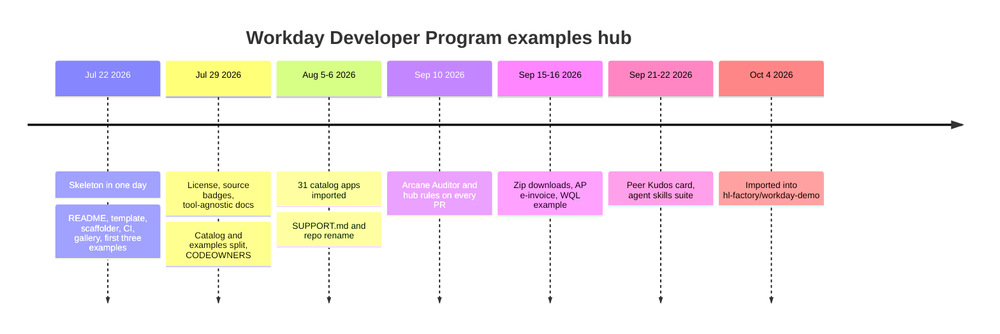

# Lore

The whole history fits in about ten weeks, from 2026-07-22 to 2026-10-01, with one import commit on top. It moves through four eras: building the hub's skeleton, filling the catalog, adding the PR audit, and opening up to community examples and agent skills.

## Era 1: a hub in a day (Jul 22)

ekwuno's first commit (`9a6fe2d`) was titled "Initial commit: README, contribution docs, and hub config". By the end of the same day there were thirteen commits: the example template and helper scripts (`8a8936f`), issue and PR templates with CI validation (`19d0ede`), the Astro gallery (`779c9aa`), the first three examples (`50a7c33`), and automatic gallery deploys (`e943ac1`).

The first three examples were `examples/expense-policy-agent-skill/`, `examples/employee-data-orchestration/`, and `work-from-anywhere-extend-app`. The orchestration and Extend app started with `PLACEHOLDER.md` files instead of real artifacts. The Extend app placeholder did not survive (see Era 2).

Two commits from that day still shape the code. `7982aaa` ("Compare the README table by content so formatters can reflow it") is why `tablesInSync` in `scripts/validate-examples.mjs` parses the README tables into trimmed cells and compares those, so Prettier can realign the columns without failing CI. `41c355c` added gallery screenshots under `.github/images/` because there was no hosted site yet.

## Era 2: structure and the catalog (Jul 29 to Aug 7)

Jul 29 was the second big day. The project gained the Apache 2.0 license (`121cdb1`, merged as PR #1 by chumphrey-wd), and `6086f60` made the docs tool-agnostic. Before it, the docs assumed every Extend app came from App Builder; after it, they say the hub "does not care which tooling produced" an artifact, and list App Builder, the IDE plugins, and the WDCLI side by side. The same commit added the "Use at your own pace, verify everything" note to `README.md`. `7caccd7` added the Workday and Community source badges, and `2142079` added bash and PowerShell scaffolders "for machines without Node".

The most important structural change was `bd640f8`, "Split entries into an app catalog and community examples". Right after it, `7273c09` added `.github/CODEOWNERS` with `/catalog/ @Workday/devrel` and made CI watch catalog changes. From then on, `catalog/` belonged to DevRel and `examples/` was the community's.

tony-gilfillan brought the first outside example, `examples/stock-notifications/` (PR #3, `bfdd519`), and then the catalog itself. Commit `86dbd3e` is titled "Prune app catalog to core set of 31 apps", but in this repo it added 863 files and deleted 3. The title most likely describes trimming a larger internal catalog to 31 apps before publishing; what landed in this repo was the import of those 31. The three deletions removed the `work-from-anywhere-extend-app` placeholder, since the real `catalog/workFromAlmostAnywhere/` app now existed. Two commits in this era (`86dbd3e` and `bfdd519`) carry a "Co-authored-by: Claude" trailer.

On Aug 6, `0db1d97` added `SUPPORT.md` and renamed the repo to its current name, WorkdayDeveloperProgram. `SUPPORT.md` says plainly that the hub is not an officially supported Workday product.

## Quiet weeks (Aug 8 to Sep 7)

Only one commit landed in this stretch: SRI VILLIAM SAI's PTO and leave policy agent skill (`a3d7ea4`, PR #5), merged by gilfila on Aug 24. It was the first community-contributed Agent Skill; the expense policy skill from Jul 22 had been written by the maintainer as a seed example.

## Era 3: the audit (Sep 8 to Sep 16)

On Sep 10, ekwuno merged five pull requests in one day:

| PR | Commit | Change |
| --- | --- | --- |
| #8 | `6ff0837` | Audit example PRs with Arcane Auditor and hub rules |
| #9 | `d593882` | Post inline audit comments in batches and never skip the summary |
| #11 | `b7f994a` | Run the required checks on every pull request |
| #10 | `d7a4117` | Make the best-practices guide generic |
| #12 | `6470ee5` | Quote Arcane Auditor's rule documentation verbatim |

A small follow-up in the same PR, `ff21e6d` ("Track scripts/audit (gitignore matched it by mistake)"), explains why `.gitignore` uses `/audit/` with a leading slash.

The audit's first real test was cngan-wd's AP e-invoice reference app. cngan-wd opened the folder with `c15306d` ("Create apeinvoice.md") on Sep 8, landed the full submission (`8fa7b03`) on Sep 10, and fixed audit findings in `66d50a2` and `c96d5d4`. The last one, "Fix Arcane ACTION findings in the AP e-invoice app zip", carries a Cursor co-author trailer. It merged as PR #13 on Sep 16. It is the only catalog entry added after the Aug import, and the only one shipped as a zip.

Around it, ekwuno added zip downloads to the gallery (PR #15, `b20940e` and `5848d8e`) and renamed the gallery heading to "Workday Developer Program" (`c941e9f`, `11b43bb`). SRI VILLIAM SAI added the WQL milestone celebrations orchestration (PR #14, `c935e87`).

## Era 4: community examples and agent skills (Sep 21 to Oct 1)

SRI VILLIAM SAI added the Peer Kudos home card (PR #16, `2f09378`) on Sep 21, then the largest single contribution to `examples/`: the Workday Developer agent skills suite (`2cddd08`). It added eight skills that reference catalog folders by path, so they act as a map of the catalog for AI agents. ekwuno merged it as PR #17 on Oct 1, the last upstream commit on `main`.

## The import (Oct 4)

`c9f7010` ("Initial commit", by hl-factory) and `8b3e7c7` ("Merge initial workday-demo commit") record the copy into `hl-factory/workday-demo`. They do not change any hub content. The `upstream` remote still points at `Workday/WorkdayDeveloperProgram`.

The import also carried 13 side branches. Ten are fully merged. Three each have one commit not on `main`: `best-practices-generic`, `test-demo` (Sep 22), and `test-demo-stuff` (Sep 8, which adds an `examples/test-app` folder).

## Deprecated and removed

| What | When | Why |
| --- | --- | --- |
| `work-from-anywhere-extend-app` placeholder | Aug 5 (`86dbd3e`) | Replaced by the real `catalog/workFromAlmostAnywhere/` |
| Tool-specific contributor docs | Jul 29 (`6086f60`) | Docs rewritten to work with any editor or assistant |
