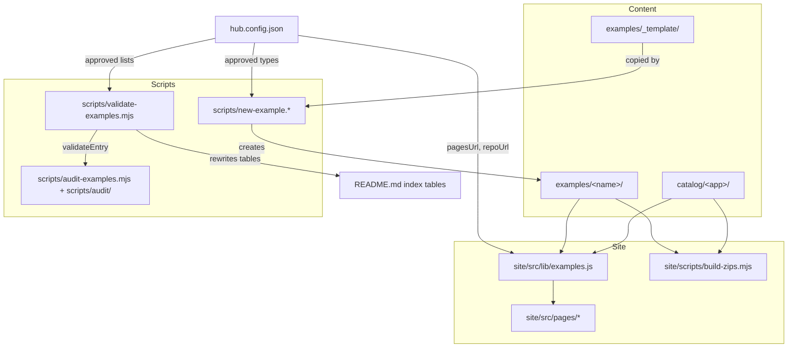
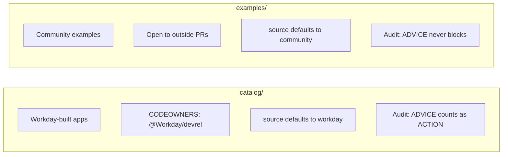
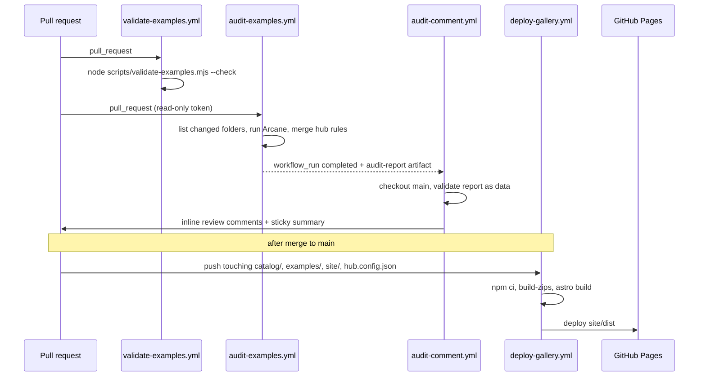
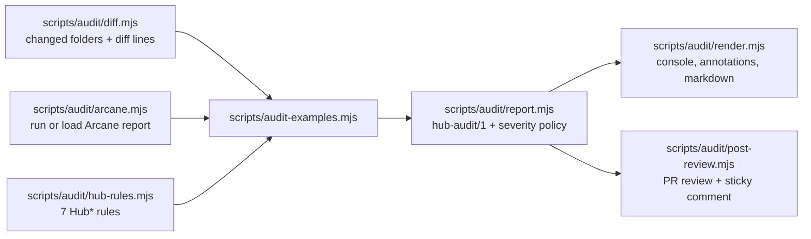
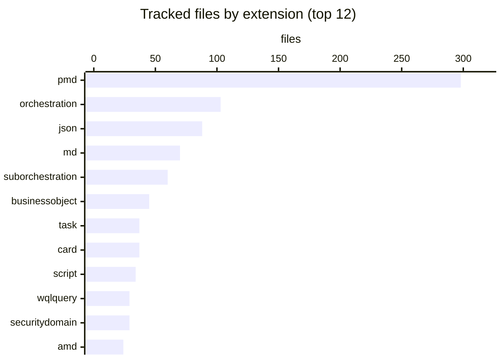

# Architecture

The repo is a content repository with a thin layer of tooling. There is no server and no runtime of its own. The "architecture" is the path an entry takes from a folder on disk to a validated, audited, published card with a download button, plus the trust boundaries in the CI that gets it there.

## Building blocks

Four rules hold the design together:

1. **The folder is the unit.** Every entry is `catalog/<id>/` or `examples/<id>/`, self-contained, with `example.json` and `README.md`. No manifest lists entries. The validator, the gallery, and the zip builder all scan the two section directories and skip names that start with `_` or `.` (`scripts/validate-examples.mjs`, `site/src/lib/examples.js`, `site/scripts/build-zips.mjs`).
2. **`hub.config.json` is the single source of truth** for the repo URL, the Pages URL, the default branch, and the approved `types`, `components`, and `products`. The validator, all three scaffolders, the audit report's doc links, the Astro config, and the zip `SOURCE.md` read it.
3. **Zero dependencies outside `site/`.** Every script under `scripts/` uses only Node built-ins (Node 20 in CI). The bash and PowerShell scaffolders exist so contributors without Node can still scaffold.
4. **The site is optional.** Nothing in `catalog/` or `examples/` depends on `site/`. The gallery reads entries at build time and never writes back.

## Two sections, two bars

`scripts/validate-examples.mjs` defines both sections in one array (`sections`), each with a `defaultSource`. A catalog entry cannot declare `"source": "community"`. `scripts/audit/report.mjs` promotes ADVICE findings to ACTION for catalog folders. `.github/CODEOWNERS` requires `@Workday/devrel` review on `/catalog/`. More in [Source badges and support](../features/source-badges-and-support.md).

## CI pipeline

Four workflows run around a pull request and a merge to `main`.

- **Validate** (`.github/workflows/validate-examples.yml`) and **Audit** (`.github/workflows/audit-examples.yml`) run on every pull request because they are required checks on `main`. Commit `b7f994a` (Sep 2026) removed their path filters for that reason.
- **Audit comment** (`.github/workflows/audit-comment.yml`) is split out because `pull_request` runs from forks get no write token. It triggers on `workflow_run`, checks out the default branch only, and treats the downloaded report strictly as data. See [Security](../security.md).
- **Deploy gallery** (`.github/workflows/deploy-gallery.yml`) rebuilds and publishes the site on pushes to `main` that touch content or the site.

Details: [Validator](../systems/validator.md), [Audit pipeline](../systems/audit/index.md), [Deployment](../deployment.md).

## Audit data flow

## Gallery data flow

`site/src/lib/examples.js` uses `import.meta.glob` to load every `catalog/*/example.json` and `examples/*/example.json` eagerly at build time, fills defaults (`source`, empty `components`, `products`, `authors`), and sorts by title. `site/src/pages/index.astro` renders cards with client-side search and filters. `site/src/pages/catalog/[id].astro` and `site/src/pages/examples/[id].astro` render one page per entry from its README via `site/src/components/EntryPage.astro`. Before `dev` and `build`, `site/scripts/build-zips.mjs` zips every entry into `site/public/downloads/<section>/<id>.zip`. See [Gallery](../systems/gallery.md) and [Example downloads](../features/example-downloads.md).

## Language and artifact breakdown

The repo is mostly Workday artifact source, not tooling. Counted by tracked file (excluding `site/package-lock.json`):

The tooling is small: 11 `.mjs` files (1,675 lines), 9 `.astro` files (569 lines), 2 `.js` files, 3 shell scripts, 2 PowerShell scripts, and 4 workflows. Full numbers are on [By the numbers](../by-the-numbers.md).

## External systems

| System | How the repo uses it |
| --- | --- |
| GitHub Actions | Validation, audit, PR comments, Pages deploy |
| GitHub Pages | Hosts the gallery at the `pagesUrl` in `hub.config.json` |
| Arcane Auditor | Community code review CLI for Extend and Orchestrate files, pinned in `.arcane-auditor/action-ref` |
| Workday tenants | Where readers deploy entries. Nothing in the repo talks to a tenant. |
| Google Fonts | The site loads the Geist font (`site/src/pages/index.astro`) |

## Related pages

- [Getting started](getting-started.md)
- [Patterns and conventions](../how-to-contribute/patterns-and-conventions.md)
- [Design decisions](../background/design-decisions.md)
