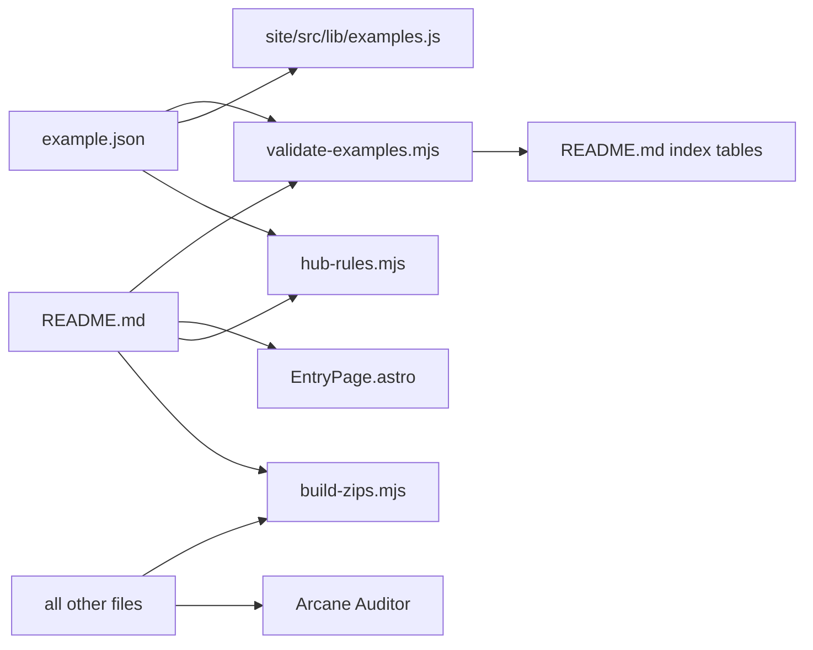

# Example entry

Active contributors: ekwuno, cngan-wd, srivilliamsai

## Purpose

An entry is one folder directly under `catalog/` or `examples/` that holds an artifact plus two files: `example.json` (metadata) and `README.md` (instructions). That pair is the whole contract between contributors and the hub tooling. The README index tables, gallery cards and pages, download zips, and audit all start from it. There are 46 entries today: 32 in `catalog/` and 14 in `examples/`.

## Folder rules

| Rule | Enforced by |
| --- | --- |
| Lives at `catalog/<name>/` or `examples/<name>/`, one level deep | `sections` in `scripts/validate-examples.mjs`; `changedDirs()` in `scripts/audit/diff.mjs` ignores files sitting directly under the section |
| Names starting with `_` or `.` are not entries | Validator, audit, gallery loader, zip builder |
| Name is kebab-case (`^[a-z0-9][a-z0-9-]*$`) | Scaffolder (hard error), `HubFolderKebabCaseRule` (audit ACTION). The validator does not check it, which is how 30 camelCase catalog folders still validate. |
| Has `README.md` and a valid `example.json` | Validator (CI error), `HubExampleJsonRule` |

## `example.json` fields

From `examples/_template/README.md` and `validateEntry()` in `scripts/validate-examples.mjs`:

| Field | Required | Validation | Used for |
| --- | --- | --- | --- |
| `title` | Yes | Non-empty | Card title, README table sort order, page title |
| `description` | Yes | Non-empty; the template text fails the audit | Card text, README table, page meta description |
| `type` | Yes | One of `hub.config.json` `types`: Extend App, Integration App, Orchestration, Agent Skill, Reference | Type icon, Type filter, README table |
| `components` | No | Each in `hub.config.json` `components` | Technology filter, card tags |
| `products` | No | Each in `hub.config.json` `products` | Product filter, card tags |
| `authors` | No | Not validated | Who gets tagged when a community entry breaks (`SUPPORT.md`) |
| `tutorial` | No | Empty or `https://...` | Tutorial button on the entry page |
| `source` | No | `workday` or `community`; not `community` in `catalog/` | Badge; defaults to `workday` in catalog, `community` in examples |

A complete example, `examples/stock-notifications/example.json`:

```json
{
  "title": "Stock Notifications",
  "description": "An Extend app that fetches Workday's current stock price from an external API and displays it on a home page card.",
  "type": "Extend App",
  "components": ["Presentation", "Card", "Model", "Orchestration"],
  "products": ["Workday Extend", "Workday Orchestrate"],
  "authors": ["tony-gilfillan"],
  "tutorial": "",
  "source": "community"
}
```

Catalog entries mostly leave `authors` empty. `catalog/ap-einvoice/example.json` is the exception, listing names rather than GitHub usernames.

## README sections

`HubReadmeSectionsRule` looks for four headings (h1 to h3), matched loosely:

1. **What it is** (ACTION if missing)
2. **What's inside** (ACTION)
3. **How to use it** (ACTION)
4. **Before you deploy** (ADVICE; ACTION in `catalog/` because of the stricter bar)

Community examples follow this format. Of the 32 catalog READMEs, 31 still use the older App Catalog format: YAML frontmatter with `title` and `description`, a `_Version 2024.1_` style line, a link to the App Catalog changelog, and "Overview", "Deploy Instructions" (Create Copy or Manual Deploy), and "Configuration Instructions" headings. See [Catalog](../catalog/index.md).

"Before you deploy" has a special role: if present, `HubAppReferenceIdRule` stops checking, and `HubHardcodedPeriodLiteralRule` skips literals the README mentions. See [Hub rules](../systems/audit/hub-rules.md).

## What reads an entry



`example.json` is the only file left out of the download zip; everything else in the folder ships, plus a generated `SOURCE.md`.

## Artifacts by type

| Type | Typical contents | Example |
| --- | --- | --- |
| Extend App | `appManifest.json`, `presentation/`, `model/`, optional `orchestration/`, `cards/`, `attributes/` | `catalog/charitableDonations/` |
| Integration App | `appManifest.json` and `orchestration/` only | `catalog/learningEnrollments/` |
| Orchestration | `orchestration/` plus supporting files (`wql/`, `sample-data/`) | `examples/wql-anniversary-celebrations/` |
| Agent Skill | `SKILL.md` | `examples/workday-pmd-skill/` |
| Reference | Anything; widget dictionaries, sampler orchestrations, or a zip | `catalog/pmdWidgetDictionary/`, `catalog/ap-einvoice/` |

See [Extend app anatomy](extend-app-anatomy.md) and [Orchestration files](orchestration-files.md).

## Key source files

| File | Purpose |
| --- | --- |
| `examples/_template/example.json` | Field skeleton |
| `examples/_template/README.md` | README skeleton and field table |
| `scripts/validate-examples.mjs` | Field validation |
| `scripts/audit/hub-rules.mjs` | Folder, README, and template checks |
| `hub.config.json` | Approved `types`, `components`, `products` |
| `site/src/lib/examples.js` | Field defaults for the gallery |

## Related pages

- [Data models](../reference/data-models.md)
- [Contribution flow](../features/contribution-flow.md)
