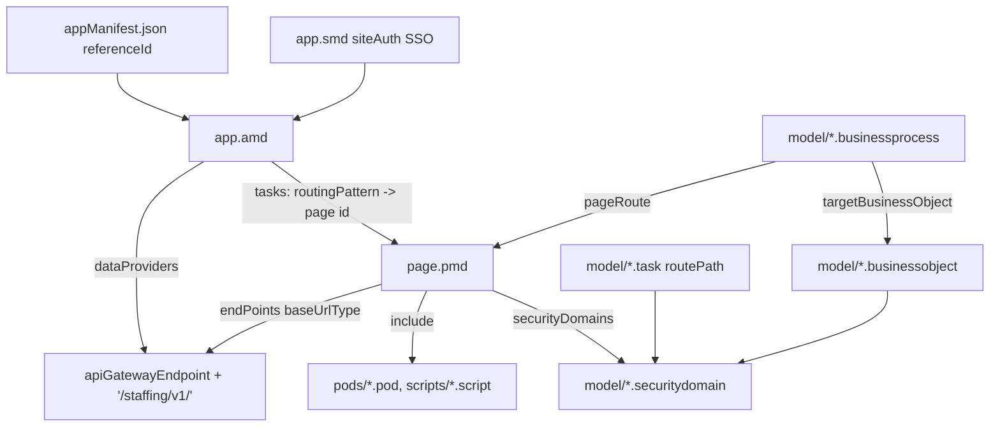

# Extend app anatomy

Active contributors: tony-gilfillan, cngan-wd, srivilliamsai

## Purpose

19 entries are Workday Extend apps (17 in `catalog/`, `examples/stock-notifications`, and `examples/peer-kudos-home-card`), and several Reference entries are Extend apps too. They are stored exactly as Workday tooling exports them: a folder of JSON-like files that App Builder, the IDE plugins, or the WDCLI can deploy to a development tenant. This page explains what each file type is, using `catalog/charitableDonations/` as the running example. The hub does not parse these files itself; [Arcane Auditor](../systems/audit/arcane.md) and two [hub rules](../systems/audit/hub-rules.md) do.

## Directory layout

```text
catalog/charitableDonations/
├── appManifest.json                     # { "referenceId": "charitableDonations", "name": "Charitable Donations" }
├── example.json, README.md              # hub wrapper, see Example entry
├── model/                               # data model and security
│   ├── Charity.businessobject
│   ├── CharityLogo.attachment, CharityFiles.attachment
│   ├── ManageCharities.securitydomain
│   ├── CharityHome.task, CreateCharity.task, ...
│   ├── CreateCharity.businessprocess
│   └── AllCharities.report
└── presentation/                        # UI
    ├── charitableDonations.amd          # app definition: tasks/routes, flows, data providers
    ├── charitableDonations.smd          # site definition: auth, languages
    ├── home.pmd, donate.pmd, ...        # 17 pages
    ├── pods/footer.pod                  # reusable page fragment
    ├── cards/AppLinks.card, ...         # cards used on hub pages
    └── scripts/fileTypes.script         # shared script
```

Other apps add `orchestration/` (Orchestrate flows used by the app), `cards/` at the root (`.carddefinition` and `.cardtenantsetting` for Workday Home cards), `attributes/default.attributes` (tenant-configurable app attributes), `presentation/wqlQueries/` and `presentation/graphQueries/`, `presentation/testing/*.mock_response`, and `presentationLabels/<locale>.properties` for translations (under `presentation/` in `catalog/vehicleRegistration/` and `catalog/tuitionReimbursement/`, at the app root in `catalog/AWSStarterKit/`).

## File types

| Extension | Count in repo | What it holds | Example |
| --- | --- | --- | --- |
| `.pmd` | 298 | A page: `id`, `securityDomains`, `endPoints`, `include`, `outboundData`, and a `presentation` widget tree | `catalog/charitableDonations/presentation/home.pmd` |
| `.amd` | 24 | Application definition: `appProperties`, `flowDefinitions`, `tasks` (id, `routingPattern`, page), `applicationId`, `dataProviders` (named base URLs) | `catalog/charitableDonations/presentation/charitableDonations.amd` |
| `.smd` | 24 | Site definition: `id`, `siteId`, `applicationId`, `languages`, `siteAuth` (SSO), `cdnEnabled`, `siteProperties` | `catalog/charitableDonations/presentation/charitableDonations.smd` |
| `.pod` | 16 | A reusable fragment included by pages (footers, endpoint bundles) | `catalog/workFromAlmostAnywhere/presentation/pods/footer.pod` |
| `.script` | 34 | Shared PMD script (JavaScript-like, not JSON) | `catalog/charitableDonations/presentation/scripts/fileTypes.script` |
| `.card` | 37 | A card rendered inside a page (pill cards, charts) | `catalog/charitableDonations/presentation/cards/AppLinks.card` |
| `.carddefinition` / `.cardtenantsetting` | 8 / 4 | A Workday Home card and the setting that exposes it with security domains and a route | `examples/peer-kudos-home-card/cards/kudosSpotlight.carddefinition` |
| `.businessobject` | 45 | Custom object: fields with types, `defaultSecurityDomains`, `defaultCollection` | `catalog/charitableDonations/model/Charity.businessobject` |
| `.securitydomain` | 29 | A security domain the tenant admin maps to groups | `catalog/charitableDonations/model/ManageCharities.securitydomain` |
| `.task` | 37 | A routable task with `routePath` and `securityDomains` | `catalog/charitableDonations/model/CharityHome.task` |
| `.businessprocess` | 9 | A business process on a business object, with approval and action steps and page routes | `catalog/workFromAlmostAnywhere/model/WorkFromAnywhereRequest.businessprocess` |
| `.attachment` | 15 | An attachment object with fields | `catalog/charitableDonations/model/CharityLogo.attachment` |
| `.report` | 7 | A report on a business object collection | `catalog/charitableDonations/model/AllCharities.report` |
| `.wqlquery` / `.graphquery` | 29 / 11 | Named WQL or Workday Graph query with parameters | `catalog/employeeRecognition/presentation/wqlQueries/employeeSearch.wqlquery` |
| `.mock_response` | 8 | Canned endpoint response for testing pages | `catalog/vehicleRegistration/presentation/testing/locations.mock_response` |

Many of these files are not strict JSON. 135 of the 298 PMDs, all 34 scripts, 27 of 29 `.wqlquery` files, and 9 of 11 `.graphquery` files fail `JSON.parse`, mostly because they embed multi-line scripts or queries inside string literals. Use Workday tooling or Arcane rather than a JSON parser to edit them programmatically.

## How the pieces connect



Script expressions sit inside `<% %>`. In the AMD, data providers are built from `apiGatewayEndpoint` and `site.applicationId`, for example `"<% apiGatewayEndpoint + '/apps/' + site.applicationId + '/v1/' %>"`. Some apps (`catalog/vehicleRegistration/`, `catalog/employeeRecognition/`, `catalog/tuitionReimbursement/`, `catalog/multiRater/`, `catalog/pmdWidgetDictionary/`) use the `{{apiGatewayEndpoint}}` template form instead. Pages then reference a provider by `baseUrlType` (`workday-staffing`, `workday-payroll`, `app`) instead of a full URL. Arcane's `HardcodedWorkdayAPIRule` and `HardcodedApplicationIdRule` exist to keep it that way.

## The app reference id

Workday generates an app reference id with a six-letter suffix for each tenant, like `stocknotifications_svfbfp`. Exported apps often carry it in AMD and SMD file names and in `applicationId`, and Workday Graph queries embed it in type names (`vehicleRegistration20241_nkzjqw_Vehicle` in `catalog/vehicleRegistration/presentation/graphQueries/distinctLocations.graphquery`). Anyone who imports the app gets a different suffix. `HubAppReferenceIdRule` flags it unless the README has a "Before you deploy" section, and the template tells authors to use `site.applicationId` in scripts. Catalog apps mostly use plain ids such as `charitableDonations`. `catalog/ap-einvoice/scripts/` ships `catalog/ap-einvoice/scripts/updateAppid.sh` and `updateAppid.ps1` to rewrite the id in its zipped source.

## Integration points

- [Arcane Auditor](../systems/audit/arcane.md) reads `.pod`, `.pmd`, `.script`, `.amd`, `.smd`, `.wqlquery`, `.orchestration`, and `.suborchestration`. Model files are not analyzed.
- `HubHardcodedPeriodLiteralRule` scans `.pmd` and `.pod` for `"value": "<period>"`; `HubAppReferenceIdRule` scans `.amd` and `.smd`.
- The [Workday agent skills](../examples/workday-agent-skills.md) review these same files (AMD routes, SMD auth, PMD security domains and widget ids) and point at catalog apps as references.

## Key source files

| File | Purpose |
| --- | --- |
| `catalog/charitableDonations/presentation/charitableDonations.amd` | Small, readable AMD |
| `catalog/charitableDonations/presentation/home.pmd` | Typical page with endpoints and widgets |
| `catalog/workFromAlmostAnywhere/model/WorkFromAnywhereRequest.businessprocess` | Business process with approval and action steps |
| `catalog/pmdWidgetDictionary/` | 62 pages demonstrating widget types |
| `catalog/pmdScripting/` | Common PMD scripting patterns |
| `examples/peer-kudos-home-card/` | Smallest complete Extend app with a Home card (12 files) |

## Related pages

- [Orchestration files](orchestration-files.md)
- [Glossary](../overview/glossary.md) for AMD, SMD, PMD, and POD
- [Catalog](../catalog/index.md)
