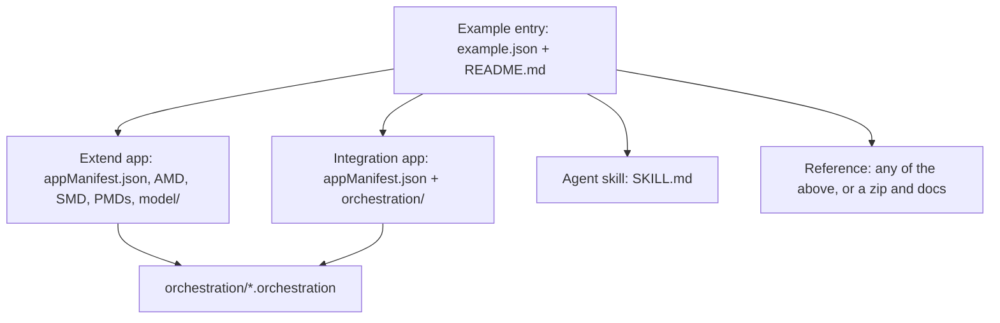

# Primitives

Three shapes recur across the repo. Every system reads the first one, and most catalog content is built from the other two.

| Primitive | What it is | Read by |
| --- | --- | --- |
| [Example entry](example-entry.md) | A folder in `catalog/` or `examples/` with `example.json` and `README.md` | Validator, scaffolder, audit, gallery, zip builder, README tables |
| [Extend app anatomy](extend-app-anatomy.md) | The `appManifest.json`, `presentation/`, `model/`, and card files inside an Extend app | Arcane Auditor, hub rules, Workday tooling |
| [Orchestration files](orchestration-files.md) | Orchestrate `.orchestration` and `.suborchestration` flows (Maya JSON) | Arcane Auditor, Orchestration Builder |

The entry wrapper is the hub's own invention. The Extend and Orchestrate files are Workday formats exported from App Builder, the IDE plugins, or Orchestration Builder, and the hub stores them as-is.
