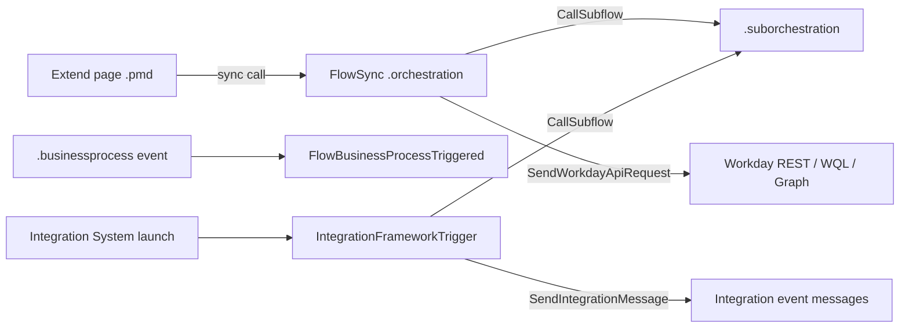

# Orchestration files

Active contributors: cngan-wd, tony-gilfillan, srivilliamsai

## Purpose

Workday Orchestrate flows are stored as `.orchestration` files, with reusable pieces in `.suborchestration` files. The repo has 103 orchestrations and 60 suborchestrations (about 4.9 MB in total) across 20 catalog entries and 3 examples. They power Integration Apps, back the server-side steps of Extend apps, and are the whole artifact for Orchestration entries. Like the Extend files, they are exported from Orchestration Builder and stored unchanged.

## File format

Every file is a single line of JSON (no pretty-printing) in a typed tree format that `examples/workday-orchestrate-skill/SKILL.md` calls the Maya file shape (flow types are literally prefixed `.maya.`). Each value is wrapped as `{"_type": ..., "_value": ...}`:

```json
{"flowVersion":"2.4.0","_type":"Flow","_value":{
  "name":{"_type":"Identifier","_value":"LogMyOrchestration"},
  "type":{"_type":"String","_value":".maya.FlowSync"},
  "start":{"_type":"StartBasic","_value":{ ... }},
  "end":{"_type":"EndSync","_value":{ ... }},
  "nodes":{"_type":["List","Node"],"_value":[{"_type":"Log","_value":{ ... }}]}
}}
```

(Excerpt from `catalog/requestCreditCard/orchestration/LogMyOrchestration.orchestration`, reformatted.)

All 163 files parse as strict JSON, unlike many Extend files. Because each is one line, `git diff` shows a whole-file change for any edit, and line-based audit findings point at line 1.

## Flow types

The `_value.type` field says how the flow is started:

| Type | Files | Started by | Where |
| --- | --- | --- | --- |
| `.maya.FlowSync` | 67 | A synchronous call, typically from an Extend page or REST | Extend apps and references |
| `.maya.FlowSubflow` | 60 | Another flow via `CallSubflow` (these are the `.suborchestration` files) | `catalog/capitalProjectPlanning/` has 45 |
| `.maya.IntegrationFrameworkTrigger` | 31 | Launch / Schedule Integration in the tenant (Integration System) | Integration Apps; 19 in `catalog/orchestrateForIntegrationsSampler/` |
| `.maya.FlowBusinessProcessTriggered` | 3 | A business process event | `catalog/tuitionReimbursement/`, `catalog/requestCreditCard/`, `catalog/capitalProjectPlanning/` |
| `.maya.FlowAsync` | 1 | Asynchronous call | `catalog/employeeRelationsIncidentManagement/orchestration/deleteCases.orchestration` |
| `.Mixed.MixedFlow` | 1 | Error-handler reference flow | `catalog/orchestrationToolkit/orchestration/AsynchGlobalErrorHandlerLogging.orchestration` |

`flowVersion` ranges from `2.4.0` to `3.3.0`; `3.0.0` is the most common (69 files).

## Common node types

Counting `_type` tags across all files, the most frequent step types are `SendWorkdayApiRequest` (165), `CallSubflow` (109), `Log` (102), `Loop` (79), `BranchOnConditions` (72), `SendIntegrationMessage` (68), and `ErrorHandler` (116). Credentials appear as `WorkdayCredentialRef` and `AccessTokenFromInitiatingUser` references rather than literal secrets.

## How flows connect to the rest of an entry



Integration Apps (`catalog/learningEnrollments/`, `catalog/employeeDemographicOutbound/`, and others) contain only `appManifest.json` and `orchestration/`. Their READMEs walk through creating a custom report and an Integration System in the tenant, then launching it.

## Audit coverage

Both extensions are in `ARCANE_EXTENSIONS`, so [Arcane Auditor](../systems/audit/arcane.md) checks them with its Orchestration rules: `OrchestrationSecurityDomainRule`, `OrchestrationGlobalErrorHandlerRule` and `OrchestrationApiStepErrorHandlerRule` (both downgraded to ADVICE in `.arcane-auditor/config.json`), `OrchestrationBranchOnConditionsNestingRule`, `OrchestrationVerboseBooleanCheckRule`, and `OrchestratePreferExplicitDefaultAccessor`. The `examples/workday-orchestrate-skill/SKILL.md` agent skill reviews the same file shape by hand.

## Large files

| File | Size |
| --- | --- |
| `catalog/prismAndExtendDesignPatterns/orchestration/install.orchestration` | 560 KB |
| `catalog/workerInboundImageUpload/` test-data generator (`TEST_GenerateMockData_TestPhotos`) | 514 KB |
| `catalog/employeeRelationsIncidentManagement/` `intGeneratePDFandAttachments` | 490 KB |

All three are large because of inline string payloads rather than step count. The photo generator embeds about 495 KB of base64 PNG data, and `catalog/prismAndExtendDesignPatterns/orchestration/install.orchestration` has only six `SendWorkdayApiRequest` steps but carries large text values inside them.

## Key source files

| File | Purpose |
| --- | --- |
| `catalog/requestCreditCard/orchestration/LogMyOrchestration.orchestration` | Small, readable FlowSync |
| `examples/wql-anniversary-celebrations/orchestration/milestoneAnniversaries.orchestration` | WQL call plus formatting, documented step by step in its README |
| `catalog/orchestrateForIntegrationsSampler/orchestration/` | 19 reference integration patterns |
| `catalog/orchestrationToolkit/` | 25 orchestrations of Extend-oriented patterns (error handling, logging, model data) |
| `catalog/capitalProjectPlanning/orchestration/` | 12 orchestrations and 45 suborchestrations |

## Related pages

- [Extend app anatomy](extend-app-anatomy.md)
- [Orchestrations](../examples/orchestrations.md)
- [Glossary](../overview/glossary.md) for Maya and ISU
