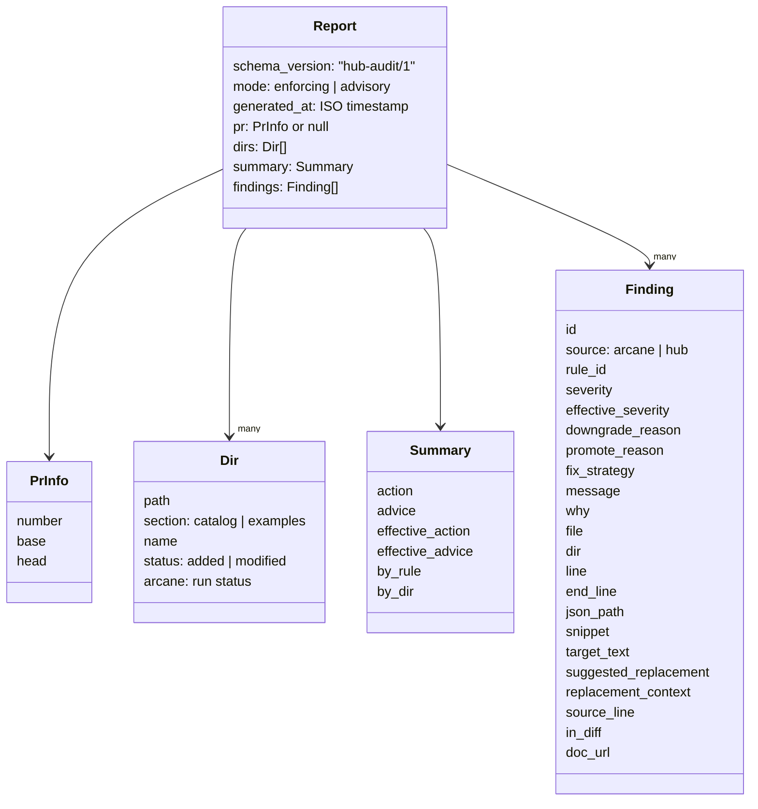

# Data models

The hub has no database. Its data models are file formats: the entry metadata, the audit report, and the files the gallery generates. Workday artifact formats are summarized at the end and covered in the primitives section.

## `example.json`

One per entry. Validated by `validateEntry` in `scripts/validate-examples.mjs`.

| Field | Type | Required | Rule |
| --- | --- | --- | --- |
| `title` | string | Yes | Non-empty |
| `description` | string | Yes | Non-empty |
| `type` | string | Yes | One of `hub.config.json` `types` |
| `components` | string[] | No | Each from `components` |
| `products` | string[] | No | Each from `products` |
| `authors` | string[] | No | GitHub usernames by convention; not validated |
| `tutorial` | string | No | Must start with `https://`, or be empty or absent |
| `source` | `"workday"` or `"community"` | No | Defaults by section; `catalog/` entries cannot be `community` |

Example from `examples/stock-notifications/example.json`:

```json
{
  "title": "Stock Notifications",
  "description": "An Extend app that fetches Workday's current stock price from an external API and displays it on a home page card.",
  "type": "Extend App",
  "components": ["Presentation", "Card", "Model", "Orchestration"],
  "products": ["Workday Extend", "Workday Orchestrate"],
  "authors": ["tony-gilfillan"],
  "tutorial": "",
  "source": "community"
}
```

`validateEntry` returns `{ errors, entry }`, where `entry` is `{ id, sectionMarkers, path, title, description, type }`. `rowsFor` uses `sectionMarkers` to place the entry in the right README table. See [Example entry](../primitives/example-entry.md).

## Audit report (`hub-audit/1`)

Written by `buildReport` in `scripts/audit/report.mjs`, to stdout or `--output` (CI: `audit/report.json`). Read by `scripts/audit/post-review.mjs`.



Key finding fields:

| Field | Meaning |
| --- | --- |
| `id` | `<source>:<rule_id>:<file>:<json_path or line>` |
| `severity` | What the rule said: `ACTION` or `ADVICE` |
| `effective_severity` | What CI acts on, after policy |
| `promote_reason` | `catalog-strict` when ADVICE was raised in `catalog/` |
| `downgrade_reason` | `pre-existing-line` or `advisory-mode` |
| `fix_strategy` | `actionable` (has a mechanical fix) or `human_review` |
| `line` | 1-based; `0` for file-level findings |
| `in_diff` | `true` or `false` when diff context exists and `line > 0`; `null` otherwise |
| `target_text`, `suggested_replacement`, `replacement_context` | Inputs for a GitHub suggestion block |
| `doc_url` | `<repoUrl>/blob/<defaultBranch>/docs/EXAMPLE_BEST_PRACTICES.md#<rule_id lowercased>` |

`scripts/audit/post-review.mjs` re-validates every field before use (see [Security](../security.md)). A `Dir.arcane` value is Arcane's per-folder run record (`status` of `ok`, `skipped`, `missing`, or `error`, with `exit_code`), or `{ status: "not-run" }` when Arcane was skipped.

Also written in CI: `audit/pr.json` with the same `{ number, base, head }` as `pr`, and `audit/arcane.json`, the raw report from the Arcane action. That file's shape is `{ schema_version, summary, runs: [{ path, status, exit_code, findings }], findings }`, and `loadArcaneReport` accepts it through `--merge`.

## Hub rule finding

Each function in `scripts/audit/hub-rules.mjs` returns objects shaped like:

```text
{ rule_id, severity, fix_strategy, message, file, line,
  target_text?, suggested_replacement?, replacement_context? }
```

`file` is repo-relative and `line` is 0 for file-level findings. `buildReport` normalizes these into the `Finding` shape above.

## Zip and `SOURCE.md`

`site/scripts/build-zips.mjs` writes `site/public/downloads/<section>/<id>.zip`. Each zip holds the entry folder (minus `example.json`, `.gitkeep`, `.DS_Store`, `node_modules`, `.git`) with every file timestamped `2000-01-01T00:00:00Z`, plus a generated `SOURCE.md` from `sourceMarkdown` in `site/src/lib/gitTrace.js`. `SOURCE.md` contains a table with the repository, folder, commit SHA (or "unknown (local build)"), build date (commit date), a link to browse that snapshot, and the hub page URL, followed by a sparse-checkout snippet and steps to contribute changes back. See [Example downloads](../features/example-downloads.md).

## Workday artifact formats

Entries contain Workday's own file formats. The ones that matter for the hub:

| Format | Shape | More |
| --- | --- | --- |
| `.orchestration`, `.suborchestration` | Single-line JSON with exactly three top-level keys: `flowVersion`, `_type`, `_value` | [Orchestration files](../primitives/orchestration-files.md) |
| `.amd`, `.smd` | JSON: application id, data providers, site configuration | [Extend app anatomy](../primitives/extend-app-anatomy.md) |
| `.pmd`, `.pod` | JSON-like page and pod definitions with embedded script; 135 of 298 PMDs are not strict JSON | [Extend app anatomy](../primitives/extend-app-anatomy.md) |
| `.businessobject`, `.task`, `.securitydomain`, `.businessprocess` | JSON model and security definitions | [Extend app anatomy](../primitives/extend-app-anatomy.md) |
| `.mock_config` | `{ "mappings": [{ "location": { "endPointName" }, "mockId" }] }` | [Testing](../how-to-contribute/testing.md) |
| `.mock_response` | `{ "id", "responseCode", "responseBody" }` | [Testing](../how-to-contribute/testing.md) |
| `SKILL.md` | Markdown with YAML front matter (`name`, `description`) | [Workday agent skills](../examples/workday-agent-skills.md) |
