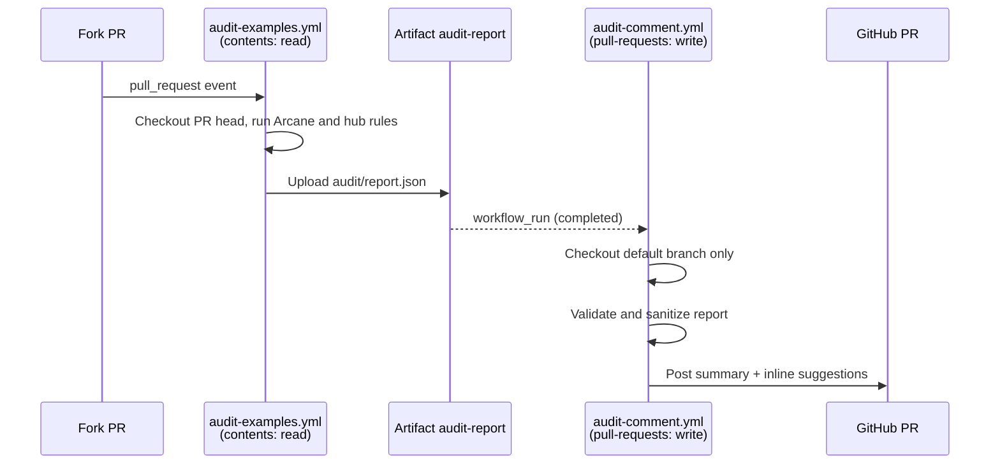

# Security

This repo has no running service, no user data, and no secrets of its own. Its security concerns fall into three areas: CI that handles pull requests from forks, the supply chain of the audit tool, and the content of the entries, which people copy into real Workday tenants.

## CI and untrusted pull requests

Pull requests from forks run untrusted code, so the audit is split across two workflows.

| Control | Where | What it prevents |
| --- | --- | --- |
| Audit has only `contents: read` | `.github/workflows/audit-examples.yml` | PR code cannot write to the repo or comment |
| Comment job checks out the default branch, never the PR head | `.github/workflows/audit-comment.yml` | PR code never runs with a write token |
| PR number comes from the `workflow_run` event, looked up by head owner, branch, and SHA | `resolvePr` in `scripts/audit/post-review.mjs` | A forged artifact cannot redirect comments to another PR |
| Report validation: `schema_version` must be `hub-audit/1`, at most 500 findings, paths must match `^(examples|catalog)/` and contain no `..` | `scripts/audit/post-review.mjs` | Malformed or hostile artifacts are rejected |
| Field sanitizing: strings truncated, `rule_id` stripped to `[A-Za-z0-9_]`, `doc_url` accepted only for `https://github.com/` | `scripts/audit/post-review.mjs` | Markdown or link injection in comments |
| At most 40 inline comments | `MAX_INLINE` in `scripts/audit/post-review.mjs` | Comment flooding |
| Artifact retention 7 days | `.github/workflows/audit-examples.yml` | Stale reports lingering |

The workflow header says it plainly: the comment job "only ever reads the audit artifact as data. It never checks out or runs anything from the pull request itself."

The gallery deploy has `pages: write` and `id-token: write`, but only runs on pushes to `main`, after review.

## Supply chain

| Component | Pinning | Note |
| --- | --- | --- |
| Arcane Auditor GitHub Action | Full commit SHA (`Ekwuno/ArcaneAuditor@c31316d1...`) | The workflow comment says the action is "from the Ekwuno fork main", not the upstream `Developers-and-Dragons/ArcaneAuditor`. The action verifies the CLI download by sha256 |
| `scripts/install-arcane.sh` | Same SHA, from `.arcane-auditor/action-ref` | Downloads a shell script from `raw.githubusercontent.com` and runs it with `bash`. Trust rests on the pinned commit |
| Other actions (`actions/checkout@v7`, `actions/setup-node@v7`, `actions/upload-artifact@v4`, `actions/download-artifact@v4`, `actions/github-script@v7`, Pages actions) | Major version tags | Tags can move; pinning by SHA would be stricter |
| `scripts/` | No dependencies | Nothing to audit beyond Node itself |
| `site/` | `site/package-lock.json`, `npm ci` in CI | 440 packages, all build-time; the deployed site is static HTML |

`.arcane-auditor/README.md` documents how to bump Arcane: record the release's asset hashes, add them to the action's `install.sh`, then update both the workflow `uses:` line and `action-ref`.

## Entry content

`CONTRIBUTING.md` requires "No credentials, tenant names, or real personal data anywhere in the folder. Sample data must be clearly fictional." A pattern scan of the tracked files at `8b3e7c7` for AWS keys, private key blocks, GitHub and Slack tokens, Stripe keys, and literal password or secret values found nothing.

Patterns worth knowing when reviewing or reusing entries:

- **Credential placeholders.** `examples/stock-notifications/` uses an orchestration credential named `onrender` with `YOUR_USERNAME` and `YOUR_PASSWORD` placeholders, and its README says "never commit real ones". The orchestration calls an external host (`stockinfo-a6k3.onrender.com`) that the reader does not control.
- **Integration System User accounts.** Several READMEs have readers create ISUs and security groups. `catalog/requestCreditCard/README.md` requires the exact name `Default_ISU` if the orchestration is deployed unedited. Grant these accounts only the domains the README lists.
- **Security domains.** Extend apps declare access through 29 `.securitydomain` files and `securityDomains` in PMDs. Only 90 of 298 PMDs declare `securityDomains`; the rest rely on the app or task level. Check this before deploying a catalog app anywhere but a development tenant.
- **Hardcoded hosts and app ids.** `HardcodedWorkdayAPIRule` and `HardcodedApplicationIdRule` are both ACTION, so a copied example does not quietly call another tenant or another app.
- **Debug logging.** About 93 live `console.*` calls remain in catalog PMD, pod, and script files. Some are intentional (`catalog/pmdScripting/`), others are leftover. `ScriptConsoleLogRule` blocks new ones in PRs. Logged values can include worker data, so remove them before production use.
- **AI and external services.** The AI Gateway skill tells agents to call the Gateway from inside the Workday boundary and to treat model output as untrusted. The AWS apps need an Innovation Service Agreement and route tenant data to AWS Lambda ([AI and AWS apps](catalog/ai-and-aws.md)).
- **Base64 payloads.** `catalog/workerInboundImageUpload/` embeds test images as base64 inside orchestrations. They are mock photos, but the pattern hides content from casual review.

## Support and disclosure

`SUPPORT.md` says the hub is not an officially supported Workday product. There is no `SECURITY.md`; security problems in an entry would go through a GitHub issue under the support policy, and Workday product or tenant issues go through normal Workday support channels. See [Source badges and support](features/source-badges-and-support.md).

## Related pages

- [Deployment](deployment.md)
- [PR comments](systems/audit/pr-comments.md)
- [Pitfalls](background/pitfalls.md)
