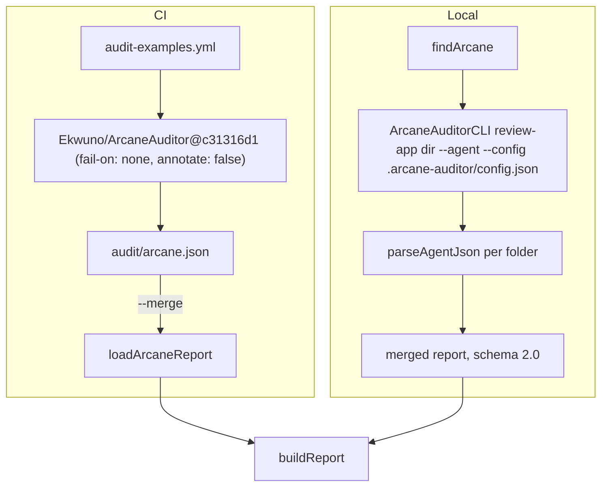

# Arcane Auditor

Active contributors: ekwuno

## Purpose

[Arcane Auditor](https://github.com/Developers-and-Dragons/ArcaneAuditor) is a community CLI that reviews Workday Extend and Orchestrate source files against 48 rules (script quality, endpoint safety, widget ids, hardcoded URLs and ids, orchestration error handling, naming). The hub runs it on every changed folder and merges its findings with the [hub rules](hub-rules.md). `scripts/audit/arcane.mjs` is the adapter: it finds or runs the binary locally, or loads the report that Arcane's GitHub Action produced in CI.

## Which files it reads

`ARCANE_EXTENSIONS` in `scripts/audit/arcane.mjs` and `file_processing.relevant_extensions` in `.arcane-auditor/config.json` list the same eight extensions: `.pod`, `.pmd`, `.script`, `.amd`, `.smd`, `.wqlquery`, `.orchestration`, `.suborchestration`. A folder with none of them (an agent skill, for example) is recorded as `skipped` and Arcane does not run on it. Model files such as `.businessobject`, `.task`, and `.securitydomain` are not analyzed.

## Local run versus CI

**CI.** `.github/workflows/audit-examples.yml` uses the action pinned to `Ekwuno/ArcaneAuditor@c31316d1147cb0e2d3f47688e668f7f3b2f9e887` (the workflow comment says "v2.0.0 CLI, action from the Ekwuno fork main"). The action installs a sha256-verified CLI and writes `audit/arcane.json`. Annotations and failure are left to the hub's merge step so both rule sets render together.

**Local.** `findArcane()` looks for the binary in this order:

1. `ARCANE_AUDITOR_CMD` (split on whitespace, so it can be a wrapper command)
2. `ARCANE_AUDITOR_BIN`
3. `.arcane-auditor/bin/ArcaneAuditorCLI` (where `scripts/install-arcane.sh` puts it)
4. `~/.arcane-auditor/bin/ArcaneAuditorCLI`
5. `ArcaneAuditorCLI` on `PATH` (`which` or `where`)

If none is found, the run fails with exit 3 and the message "Arcane Auditor not found. Run ./scripts/install-arcane.sh, or set ARCANE_AUDITOR_BIN, or use --skip-arcane."

`scripts/install-arcane.sh` reads `.arcane-auditor/action-ref`, downloads `.github/action/install.sh` from that exact commit with `curl`, and runs it with `ARCANE_INSTALL_DIR=.arcane-auditor/bin`, so local and CI use the same CLI version.

## Synthetic findings

The adapter adds two rule ids of its own:

| Rule id | Severity | When |
| --- | --- | --- |
| `ArcaneAuditorError` | ACTION | The CLI exits with status 2 or higher, crashes, or prints output with no JSON document. Never downgraded by the pre-existing-line policy. |
| `ArcaneAuditorWarning` | ADVICE | The CLI printed text before its JSON (usually that the script parser gave up on a block, so script rules were skipped for it). In CI the same is reconstructed from `run.warnings`. |

`parseAgentJson()` skips everything before the first line starting with `{` or `[`; that skipped text is the "preamble" that becomes the warning.

`listRules()` calls `ArcaneAuditorCLI list-rules --format json` once and caches rule descriptions, which become the "Why:" line in PR comments. With no binary (CI merge mode on a machine without Arcane, or `--skip-arcane`), the map is empty and comments have no "Why:" for Arcane rules.

## Hub configuration

`.arcane-auditor/config.json` was generated with `ArcaneAuditorCLI generate-config` and keeps all 48 rules enabled. Four rules are changed, as documented in `.arcane-auditor/README.md`:

| Rule | Change | Reason given |
| --- | --- | --- |
| `HardcodedApplicationIdRule` | ADVICE to ACTION | A hardcoded app id guarantees a copy breaks, and the fix (`site.applicationId`) is mechanical |
| `OrchestrationGlobalErrorHandlerRule` | ACTION to ADVICE | Error-handler scaffolding is not always the lesson an example teaches |
| `OrchestrationApiStepErrorHandlerRule` | ACTION to ADVICE | Same reasoning |
| `PMDSectionOrderingRule` | fix strategy to `human_review` | Arcane v2.0.0 has no fix payload for it, so "actionable" produced empty suggestions |

`fail_on_severe` and `fail_on_warning` are both `false`; blocking is decided by `scripts/audit/report.mjs`, not by Arcane.

## Bumping Arcane and the regression check

`.arcane-auditor/README.md` has a five-step bump procedure: add new CLI hashes to the action's `install.sh`, bump its version, update `action-ref` and the `uses:` line to the new commit, regenerate and re-diff `.arcane-auditor/config.json`, then re-run the regression check. The reference case is upstream PR #7 (`examples/Promotion_Nomination`), which is expected to produce 62 findings, 32 of them blocking, with Arcane v2.0.0. The README lists the expected findings rule by rule.

## Key source files

| File | Purpose |
| --- | --- |
| `scripts/audit/arcane.mjs` | `findArcane`, `hasArcaneFiles`, `runArcane`, `loadArcaneReport`, `listRules`, `parseAgentJson` |
| `scripts/install-arcane.sh` | Local install pinned to `action-ref` |
| `.arcane-auditor/config.json` | Rule configuration |
| `.arcane-auditor/action-ref` | Pinned action commit |
| `.arcane-auditor/README.md` | Rule policy, bump steps, regression check |
| `docs/EXAMPLE_BEST_PRACTICES.md` | Arcane rule text quoted verbatim, one heading per rule |

## Related pages

- [Severity policy](severity-policy.md)
- [Security](../../security.md) for the trust model of running a third-party action
