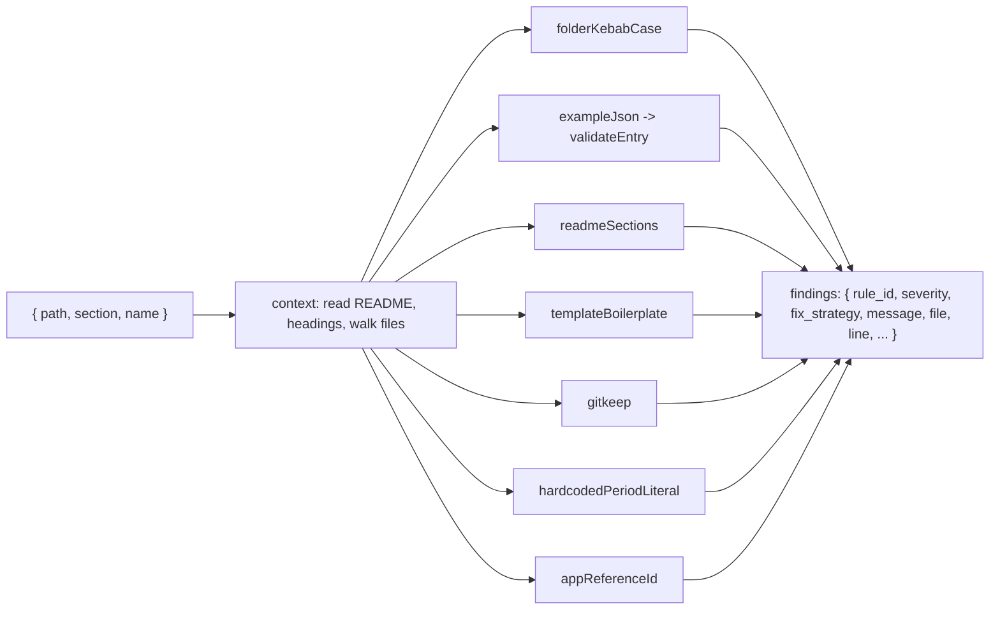

# Hub rules

Active contributors: ekwuno

## Purpose

`scripts/audit/hub-rules.mjs` holds seven rules that Arcane Auditor does not cover. They check how an entry is packaged for the hub (folder name, metadata, README) and two portability traps that break copies in another tenant. They need no binary, so `node scripts/audit-examples.mjs --skip-arcane` runs them anywhere Node 20 runs.

## The rules

| Rule | Default severity | Fires when | Line | Fix |
| --- | --- | --- | --- | --- |
| `HubFolderKebabCaseRule` | ACTION | Folder name fails `^[a-z0-9][a-z0-9-]*$` | 0 (folder) | Rename; the finding suggests a kebab-case name built from camelCase |
| `HubExampleJsonRule` | ACTION | Any `validateEntry()` error, or a root `.json` file whose first line is not JSON | 0, or 1 for the stray first line | Fix the field; if `example.json` is missing and another root JSON has `title` and `description`, it suggests renaming that file |
| `HubReadmeSectionsRule` | ACTION for the first three sections, ADVICE for "Before you deploy" | README headings (h1 to h3) lack "What it is", "What's inside", "How to use it", or "Before you deploy" | 0 | Add the sections; a README with only HTML headings gets one combined finding |
| `HubTemplateBoilerplateRule` | ACTION | `README.md` or `example.json` still contains one of five template strings, or the title is `"My Example"` | Line of the match | Replace with real content |
| `HubGitkeepRule` | ADVICE | A `.gitkeep` sits in a folder that has other files | 0 | Delete it (`replacement_context: "file_remove"`) |
| `HubHardcodedPeriodLiteralRule` | ADVICE | A `.pmd` or `.pod` has `"value": "<literal>"` matching `2026-Q1`, `2026-H1`, `2026-01`, `2026-01-15`, `FY26`, `FY2026`, or a bare four-digit year | Line of the match | Compute the value, read it from an app attribute, or mention it under "Before you deploy" |
| `HubAppReferenceIdRule` | ADVICE | An `.amd` or `.smd` file name or `applicationId`/`siteId`/`id` value matches `<letters/digits>_<6 lowercase>` and the README has no "Before you deploy" section | Line of the id | Add "Before you deploy" telling readers to replace it, or use `site.applicationId` |

Severities and one-line descriptions live in the `HUB_RULES` map at the top of `scripts/audit/hub-rules.mjs`. The descriptions become the "Why:" line in inline PR comments.

## Matching details worth knowing

- **Section headings are matched loosely.** Each required section has a `key` substring and an `alt` regex. "What's inside" also accepts "what is inside" and "contents". "How to use it" also accepts "usage", "getting started", "setup", "how to run", and "deploy". "Before you deploy" also accepts "before deploying", "what to change", and "customize for your tenant". Because "deploy" satisfies "How to use it", a README with only a "Deploy" heading passes that check.
- **"Before you deploy" turns off two rules.** If the README has that section, `HubAppReferenceIdRule` does not run at all, and `HubHardcodedPeriodLiteralRule` skips any literal that the README mentions verbatim. The section is treated as the place where portability caveats are documented. See `docs/EXAMPLE_BEST_PRACTICES.md`, section "The 'Before you deploy' contract".
- **The period regex accepts any four-digit year.** `"value": "2015"` would fire. The only hit today is `"2015-01-01"` in `catalog/pmdScripting/presentation/updateWidgetState.pmd`.
- **File-level findings use line 0.** That matters for the [severity policy](severity-policy.md): line-0 findings have `in_diff: null`, so they are never downgraded as pre-existing.

## Current findings on the whole repo

Running `node scripts/audit-examples.mjs --all --skip-arcane` on this commit:

| Rule | Findings | Where |
| --- | --- | --- |
| `HubReadmeSectionsRule` | 66 | 31 catalog READMEs lack the first three sections and 31 lack "Before you deploy" (they use the older App Catalog format); 4 examples lack only "Before you deploy": `employee-data-orchestration`, `expense-policy-agent-skill`, `pto-policy-agent-skill`, `stock-notifications` |
| `HubFolderKebabCaseRule` | 30 | Every camelCase catalog folder; only `catalog/ap-einvoice` and `catalog/wql` pass |
| `HubAppReferenceIdRule` | 4 | `stocknotifications_svfbfp` in `examples/stock-notifications/presentation/` (`.amd` and `.smd`), and `chart2CatalogApp_ycjtxv` in `catalog/chartDictionary/` |
| `HubHardcodedPeriodLiteralRule` | 1 | `catalog/pmdScripting/presentation/updateWidgetState.pmd` |

All 14 community examples pass the ACTION-level hub rules. The catalog was imported before the hub rules existed, which is why it accounts for almost every finding.

## How a rule runs

`context()` reads the README once, extracts headings with `^#{1,3}\s+(.+?)`, walks the folder (skipping `node_modules` and `.git`), and precomputes `hasBeforeDeploy`. `finding()` sets `fix_strategy: "actionable"` whenever a `suggested_replacement` is present, which is what lets [PR comments](pr-comments.md) offer a one-click suggestion.

## Entry points for modification

Add a function that takes `ctx` and returns an array of `finding(...)` results, register it in `HUB_RULES` and in the list inside `runHubRules()`, and add a `### HubYourRule` heading to `docs/EXAMPLE_BEST_PRACTICES.md`. If the rule reports a specific line, the pre-existing-line downgrade applies to it automatically.

## Key source files

| File | Purpose |
| --- | --- |
| `scripts/audit/hub-rules.mjs` | All seven rules |
| `scripts/validate-examples.mjs` | `validateEntry()`, reused by `HubExampleJsonRule` |
| `examples/_template/README.md` | Source of the template strings and the four sections |
| `docs/EXAMPLE_BEST_PRACTICES.md` | "Hub packaging" section explains each rule |
| `.arcane-auditor/README.md` | Expected hub-rule results for the PR #7 regression case |
