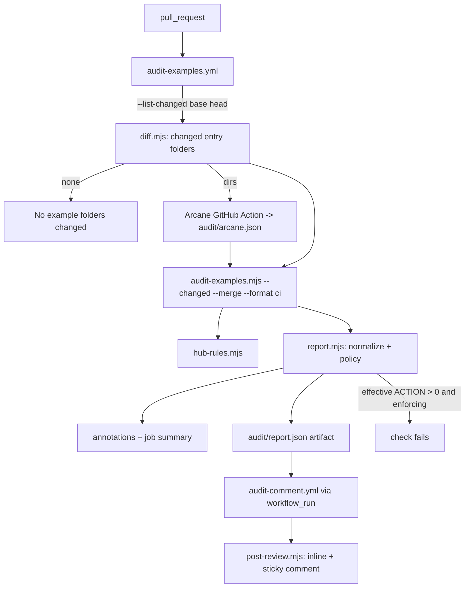

# Audit

Active contributors: ekwuno

## Purpose

The audit reviews the entry folders a pull request touches and tells the contributor what to fix. It combines two rule sets: [Arcane Auditor](arcane.md), a community CLI with 48 rules for Extend and Orchestrate source, and seven [hub rules](hub-rules.md) that check packaging (folder name, `example.json`, README sections, template leftovers, and a few portability traps). A [severity policy](severity-policy.md) decides which findings block the merge, and a second workflow [posts the results on the PR](pr-comments.md). The whole system landed in one PR on Sep 10 2026 (PR #8, commit `6ff0837`), followed the same day by PRs #9 to #12.

## Directory layout

```text
scripts/
├── audit-examples.mjs      # CLI entry point: choose folders, run both sides, build + render report
├── install-arcane.sh       # installs the pinned Arcane CLI into .arcane-auditor/bin/
└── audit/
    ├── diff.mjs            # changed folders and changed lines from git
    ├── arcane.mjs          # find/run Arcane, or load the GitHub Action's report
    ├── hub-rules.mjs       # the seven Hub* rules
    ├── report.mjs          # hub-audit/1 report, severity policy, suggestionFor
    ├── render.mjs          # console, annotations, job summary, sticky comment markdown
    └── post-review.mjs     # PR comment poster (runs in actions/github-script)
.arcane-auditor/
├── config.json             # Arcane rule config with three severity overrides
├── action-ref              # Ekwuno/ArcaneAuditor@c31316d1...
└── README.md               # rule policy, bump procedure, regression check
docs/EXAMPLE_BEST_PRACTICES.md   # 1,769 lines; one heading per rule id
.github/workflows/audit-examples.yml
.github/workflows/audit-comment.yml
```

## How it works



1. **Pick folders.** `changedDirs()` in `scripts/audit/diff.mjs` lists files changed in `base...head` (three-dot, so only the PR's own changes) under `catalog/` and `examples/`, keeps the `<section>/<name>` prefix, skips files directly under the section and `_`/`.` folders, drops deleted folders, and marks each folder `added` or `modified` by checking whether it existed at the merge base.
2. **Run Arcane.** In CI the `Ekwuno/ArcaneAuditor` action runs with `fail-on: none` and writes `audit/arcane.json`. Locally `runArcane()` calls `ArcaneAuditorCLI review-app <dir> --agent` per folder. See [Arcane Auditor](arcane.md).
3. **Run hub rules.** `runHubRules()` in `scripts/audit/hub-rules.mjs` runs seven checks per folder. See [Hub rules](hub-rules.md).
4. **Build the report.** `buildReport()` in `scripts/audit/report.mjs` normalizes both sources into one finding shape, marks whether each finding's line is in the diff, and applies the [severity policy](severity-policy.md).
5. **Render.** `--format ci` prints GitHub annotations (at most 10 errors and 10 warnings), appends markdown to the job summary, and writes `audit/report.json`.
6. **Exit.** In `enforcing` mode the script exits 1 if any finding is still ACTION after policy.
7. **Comment.** `.github/workflows/audit-comment.yml` downloads the artifact and calls `postReview()`. See [PR comments](pr-comments.md).

## Running it locally

```bash
./scripts/install-arcane.sh                                     # once; reads .arcane-auditor/action-ref
node scripts/audit-examples.mjs --changed                       # vs origin/main
node scripts/audit-examples.mjs --dirs examples/stock-notifications
node scripts/audit-examples.mjs --dirs catalog/wql --skip-arcane   # hub rules only, no binary
node scripts/audit-examples.mjs --all --format markdown            # every folder, very noisy
```

Options: `--mode enforcing|advisory`, `--format console|json|markdown|ci`, `--output <file>`, `--pr <n>`, `--merge <arcane.json>`, `--skip-arcane`, `--hub-only`, `--arcane-only`, `--rules A,B`, `--exclude-rules A,B`, and `--list-changed <base> <head>` (prints folders and writes `dirs=` to `$GITHUB_OUTPUT`). Exit codes: 0 clean or advisory, 1 blocking findings, 2 usage, 3 tooling failure.

`--all` treats every folder as `modified` with no diff map, so nothing is downgraded. Running it hub-only on this repo gives 61 ACTION and 40 ADVICE findings before policy, which become 95 blocking and 6 advisory after the catalog promotion. See [Pitfalls](../../background/pitfalls.md).

## Sub-pages

| Page | Covers |
| --- | --- |
| [Hub rules](hub-rules.md) | The seven `Hub*` rules, their triggers and fixes |
| [Arcane Auditor](arcane.md) | Binary discovery, the CI action, config overrides, error and warning findings |
| [Severity policy](severity-policy.md) | `catalog-strict`, `pre-existing-line`, advisory mode, `audit-override` |
| [PR comments](pr-comments.md) | The two-workflow split, report validation, inline suggestions, sticky comment |

## Integration points

- Imports `repoRoot`, `sections`, `config`, and `validateEntry` from `scripts/validate-examples.mjs` ([Validator](../validator.md)).
- Links every finding to `docs/EXAMPLE_BEST_PRACTICES.md#<ruleid lowercased>` on the `repoUrl` from `hub.config.json`.
- `.gitignore` excludes `/audit/` (the report output) and `.arcane-auditor/bin/`.

## Entry points for modification

To add a hub rule, write a function in `scripts/audit/hub-rules.mjs`, add it to `HUB_RULES` and `runHubRules()`, and add a `### RuleName` section to `docs/EXAMPLE_BEST_PRACTICES.md` so the doc link resolves. To change who gets blocked, edit `applyPolicy()` in `scripts/audit/report.mjs`. To change how results look on the PR, edit `scripts/audit/render.mjs` and `scripts/audit/post-review.mjs`.

## Key source files

| File | Purpose |
| --- | --- |
| `scripts/audit-examples.mjs` | CLI and orchestration of the run |
| `scripts/audit/diff.mjs` | `changedDirs`, `diffLineMap`, `dirInfo` |
| `scripts/audit/arcane.mjs` | Arcane runner and report loader |
| `scripts/audit/hub-rules.mjs` | Hub rules |
| `scripts/audit/report.mjs` | Report schema and policy |
| `scripts/audit/render.mjs` | Output formats |
| `scripts/audit/post-review.mjs` | PR comments |
| `.github/workflows/audit-examples.yml` | CI audit job |
| `.github/workflows/audit-comment.yml` | CI comment job |
| `docs/EXAMPLE_BEST_PRACTICES.md` | Rule explanations linked from every finding |
