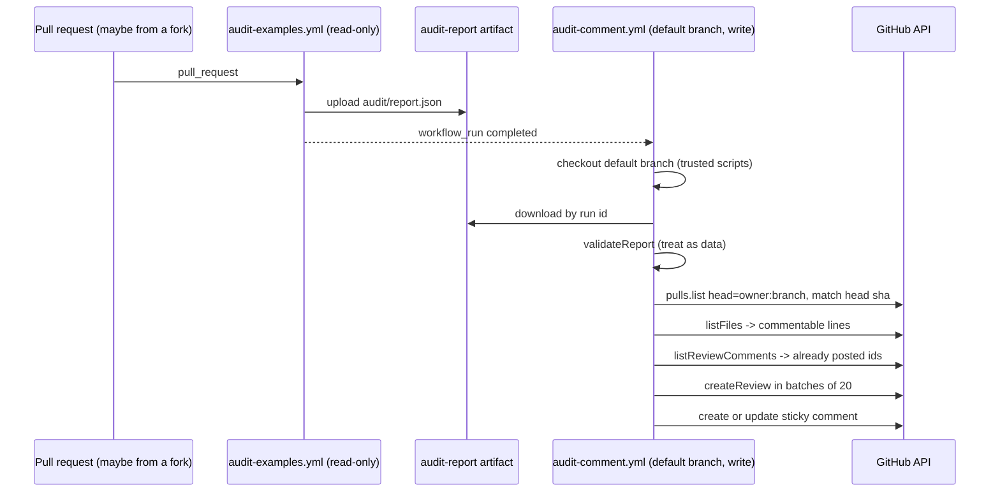

# PR comments

Active contributors: ekwuno

## Purpose

Audit results reach the contributor in three places: annotations on the "Audit examples" check, the job summary, and comments on the PR itself. The comments come from a separate workflow, `.github/workflows/audit-comment.yml`, which runs `postReview()` from `scripts/audit/post-review.mjs`. It posts up to 40 inline review comments (with one-click GitHub suggestions where the fix is mechanical) plus one sticky summary comment that is updated on every run.

## Why two workflows

Pull requests from forks get a read-only token, so `.github/workflows/audit-examples.yml` cannot comment. It uploads `audit/` as the `audit-report` artifact (7-day retention, uploaded even when the check fails) and stops. `.github/workflows/audit-comment.yml` is triggered by `workflow_run` when "Audit examples" completes. That event runs the workflow file and scripts from the default branch with `pull-requests: write`.

The comment job is skipped unless the triggering run came from a `pull_request` event and was not cancelled. Concurrency is keyed on the head SHA with `cancel-in-progress`.

## Treating the report as untrusted

The artifact was produced by code from the PR, so `validateReport()` re-checks every field before anything is posted:

- `schema_version` must be `hub-audit/1`, `mode` must be `enforcing` or `advisory`
- at most 500 findings (`MAX_FINDINGS`)
- every `dirs[].path` and `findings[].file` must match `^(examples|catalog)\/[^\0]+$` and contain no `..`
- enums are coerced (`severity`, `effective_severity`, `source`, `fix_strategy`), strings are truncated (message 1000, suggestion 2000, and so on), `rule_id` is stripped to `[A-Za-z0-9_]`
- `doc_url` is kept only if it starts with `https://github.com/`

The PR number is never read from the artifact. `resolvePr()` looks it up from the `workflow_run` event's head owner, branch, and SHA, because `workflow_run.pull_requests` is empty for forks.

## Inline comments

`buildReview()` walks the findings and, for each one not already posted:

- skips it to the summary if `line` is 0 or the line is not part of the PR's patch (`commentableLines()` parses `@@` hunks from `pulls.listFiles`)
- stops adding inline comments after 40 (`MAX_INLINE`)

Each inline body has the rule id and severity, the message, a "Why:" line from the rule description, a suggestion block, a "Read more" link, and a hidden `<!-- finding:<id> -->` marker. On the next run, `existingFindingIds()` reads those markers from bot review comments and skips findings that are already on the PR.

Comments go out with `pulls.createReview` in batches of 20 (`event: "COMMENT"`). A failed batch logs a warning and does not stop the summary comment. Commit `d593882` (PR #9) added this after large reviews caused GitHub to return a 502 after the review had already been created.

### When a suggestion is one-click

`suggestionFor()` in `scripts/audit/report.mjs` returns a full replacement line only when the finding is `actionable`, has a `suggested_replacement` and the source line, and either `replacement_context` is `full_line`, or it is `substring`/`full_field` with `target_text` present in the line and a single-line replacement. Two special cases handle Extend script syntax:

- If Arcane suggests `<% apiGatewayEndpoint + '/path' %>` for a URL that is already inside `<% %>`, the quoted literal is replaced by the inner expression instead of nesting a second `<% %>`.
- If the replacement is a bare expression like `site.applicationId` and the target sits inside a quoted string within script, it is spliced in as concatenation (`'pre' + site.applicationId + 'post'`).

Otherwise the comment shows the suggested change as a plain code block.

## The sticky summary

`toMarkdown(report, { forComment: true })` in `scripts/audit/render.mjs` starts with `<!-- hub-audit -->`. `upsertStickyComment()` finds a bot comment containing that marker and edits it, or creates one. The body has:

- the audited folders and a "Passed:" line for categories with zero findings (hub packaging, hardcoded URLs and app ids, debug logging)
- an advisory-mode banner when relevant
- "Fix before merge" (ACTION) and a collapsible "Suggestions" (ADVICE) table, each capped at 150 rows
- how to run the audit locally, and a note that maintainers can add `audit-override`
- if the check failed in enforcing mode, a banner at the top saying so
- a count of file-level findings that appear only in the summary

## Key source files

| File | Purpose |
| --- | --- |
| `.github/workflows/audit-comment.yml` | `workflow_run` trigger, permissions, artifact download, `github-script` call |
| `scripts/audit/post-review.mjs` | `validateReport`, `resolvePr`, `commentableLines`, `buildReview`, `existingFindingIds`, `upsertStickyComment`, `postReview` |
| `scripts/audit/render.mjs` | `toMarkdown`, `toAnnotations` |
| `scripts/audit/report.mjs` | `suggestionFor` |

## Related pages

- [Security](../../security.md)
- [Audit](index.md)
