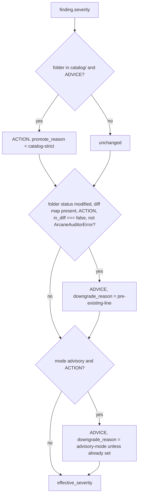

# Severity policy

Active contributors: ekwuno

## Purpose

Every finding keeps two severities: `severity` (what the rule said) and `effective_severity` (what CI acts on). `applyPolicy()` in `scripts/audit/report.mjs` converts one to the other with three rules, applied in order. The goal stated in the file header is that catalog apps meet a stricter bar, contributors are only blocked on what they wrote, and maintainers can turn blocking off.

## The three steps



| Step | Condition | Effect | Reason field |
| --- | --- | --- | --- |
| 1. Catalog strict | Folder's section is `catalog` and the rule said ADVICE | Becomes ACTION | `promote_reason: "catalog-strict"` |
| 2. Pre-existing line | Folder existed at the merge base (`status: "modified"`), a diff map exists, the finding is ACTION, its line is not in the diff (`in_diff === false`), and it is not `ArcaneAuditorError` | Becomes ADVICE; any promotion is cleared | `downgrade_reason: "pre-existing-line"` |
| 3. Advisory mode | `--mode advisory` | Every remaining ACTION becomes ADVICE | `downgrade_reason: "advisory-mode"` (kept as `pre-existing-line` if already set) |

The check fails when `mode === "enforcing"` and `summary.effective_action > 0`.

## Who sets the mode

In `.github/workflows/audit-examples.yml`:

```yaml
AUDIT_MODE: ${{ contains(github.event.pull_request.labels.*.name, 'audit-override') && 'advisory' || vars.AUDIT_MODE || 'enforcing' }}
```

- The `audit-override` label on a PR makes that PR advisory. The sticky comment tells maintainers they can use it.
- The repository variable `AUDIT_MODE=advisory` makes every PR advisory.
- Otherwise the mode is `enforcing`.

## What `in_diff` means

`diffLineMap()` in `scripts/audit/diff.mjs` runs `git diff -U0` over the PR range and records every right-side line number per file. `normalize()` in `scripts/audit/report.mjs` then sets:

- `in_diff: true` or `false` for findings with a line number above 0
- `in_diff: null` for file-level findings (line 0), or when there is no diff map (`--dirs`, `--all`, `workflow_dispatch`)

Because step 2 requires `in_diff === false`, file-level findings are never downgraded. A PR that edits one line in an existing catalog folder therefore inherits that folder's line-0 findings: `HubFolderKebabCaseRule` for any camelCase folder, `HubReadmeSectionsRule` for the old README format, and `ArcaneAuditorWarning` promoted to ACTION by step 1. In practice, touching almost any existing catalog folder blocks the PR until those are fixed or a maintainer adds `audit-override`. See [Pitfalls](../../background/pitfalls.md).

New folders (`status: "added"`) are never downgraded, so every finding in a new submission counts.

## How the reasons show up

- Console: `ACTION (was ADVICE: catalog-strict)`
- Summary and comment tables: "(catalog apps are held to the stricter bar)" or "(pre-existing code, not blocking)"
- Inline comments: `(ADVICE, was ACTION)`

## Key source files

| File | Purpose |
| --- | --- |
| `scripts/audit/report.mjs` | `applyPolicy`, `normalize`, `buildReport` |
| `scripts/audit/diff.mjs` | `changedDirs` (added vs modified), `diffLineMap` |
| `.github/workflows/audit-examples.yml` | `AUDIT_MODE` expression |
| `.arcane-auditor/README.md` | Prose summary of the same policy |

## Related pages

- [Source badges and support](../../features/source-badges-and-support.md): the stricter bar follows the folder, not the badge
- [Design decisions](../../background/design-decisions.md)
