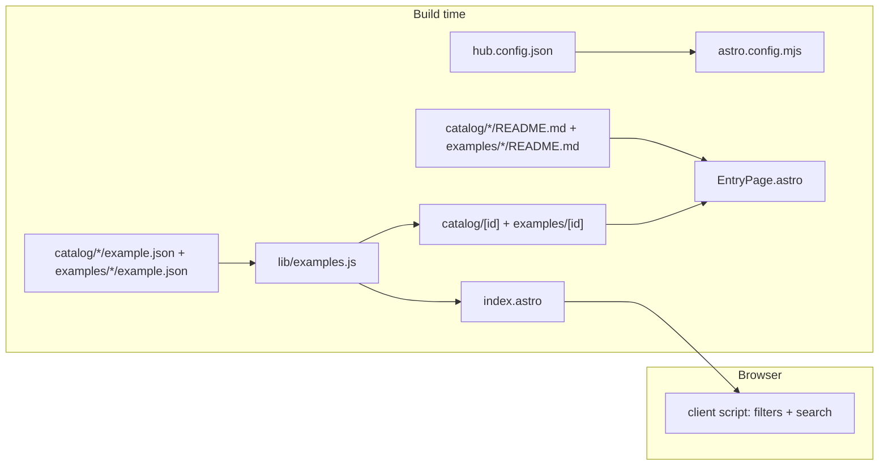

# Gallery

Active contributors: ekwuno

## Purpose

`site/` is an optional static site that lists every entry as a card, lets readers filter and search, renders each entry's README on its own page, and offers a zip download. It is built with Astro 5 and Tailwind 4 and deployed to GitHub Pages by `.github/workflows/deploy-gallery.yml`. It reads entries straight from `catalog/*/example.json` and `examples/*/example.json` at build time, so there is no manifest to maintain.

## Directory layout

```text
site/
├── astro.config.mjs            # site + base from hub.config.json pagesUrl; Tailwind Vite plugin
├── package.json                # name developer-relations-site; predev/prebuild run build-zips
├── package-lock.json           # 440 packages
├── scripts/build-zips.mjs      # see Example downloads
├── public/favicon.png
└── src/
    ├── lib/
    │   ├── examples.js         # loads entries, filters, withBase, download helpers
    │   └── gitTrace.js         # sparse checkout + SOURCE.md text
    ├── pages/
    │   ├── index.astro         # grid, filters, search (client script)
    │   ├── catalog/[id].astro  # one page per catalog entry
    │   └── examples/[id].astro # one page per community example
    ├── components/
    │   ├── Card.astro          # card with type icon, badge, download, tags
    │   ├── EntryPage.astro     # entry detail page with rendered README and TOC
    │   ├── FilterGroup.astro   # checkbox group
    │   ├── Header.astro, Footer.astro, TypeIcon.astro
    └── styles/global.css       # Tailwind import, typography plugin, wd-blue, Geist
```

## Key abstractions

| Symbol | File | Description |
| --- | --- | --- |
| `examples` | `site/src/lib/examples.js` | All entries from both sections, with defaults applied, sorted by title |
| `load(modules, dir, section, defaultSource)` | `site/src/lib/examples.js` | Turns `import.meta.glob` results into entries; drops ids starting with `_` |
| `sections`, `types`, `componentsInUse`, `productsInUse`, `sourcesInUse` | `site/src/lib/examples.js` | Filter options, built only from values that appear in entries |
| `withBase(path)` | `site/src/lib/examples.js` | Prefixes the Pages base path (`/WorkdayDeveloperProgram/`) |
| `getStaticPaths()` | `site/src/pages/catalog/[id].astro`, `site/src/pages/examples/[id].astro` | One route per entry, split by `section === "App catalog"` or `"Examples"` |
| `EntryPage` | `site/src/components/EntryPage.astro` | Finds the entry's `README.md` via glob and renders `Content` plus an h2/h3 table of contents |

## How it works



1. `site/astro.config.mjs` reads `hub.config.json` and splits `pagesUrl` into `site` (origin) and `base` (path). It allows Vite to read `..` so the site can import files from the repo root.
2. `site/src/lib/examples.js` globs every `example.json` eagerly. Each entry gets defaults (`tutorial: ""`, empty arrays, `source` by section), then the JSON overrides them. The `section` value is a display label: `"App catalog"` or `"Examples"`.
3. `site/src/pages/index.astro` renders every card into the page and five `FilterGroup`s: Section, Type, Source, Technology (the `components` field), and Product.
4. Each detail page uses `EntryPage`, which renders the README through Astro's markdown pipeline with the `@tailwindcss/typography` `prose` styles, and adds buttons for Tutorial (when set), View code, and Download zip.

## Filtering and search

Filtering happens in the browser with no framework. Each card carries `data-section`, `data-type`, `data-source`, `data-components`, `data-products` (pipe-separated), and `data-search` (lowercased title, description, id, type, badge, components, and products). The script in `site/src/pages/index.astro`:

- reads `?q=`, `?type=`, and `?section=` on load (`section=catalog` and `section=examples` map to the display labels), but does not write filter state back to the URL
- treats checkboxes within one group as OR and groups as AND
- debounces search input by 150 ms
- shows "Showing N of M examples", an empty state with a "Be the first to add one" link, and a Clear filters button when anything is set

## Styling

`site/src/styles/global.css` imports Tailwind, enables the typography plugin, and defines `--color-wd-blue: #0875e1`, `--color-wd-blue-dark: #005cb9`, and the Geist font (loaded from Google Fonts in each page head). Dark mode uses Tailwind's `dark:` variants.

## Integration points

- **Content:** reads `example.json` and `README.md` from every entry. Anything the [validator](validator.md) accepts will render.
- **Config:** `hub.config.json` supplies `repoUrl`, `defaultBranch`, and `pagesUrl`. The links still point at `Workday/WorkdayDeveloperProgram` in this copy.
- **Downloads:** `site/scripts/build-zips.mjs` runs before every dev and build. See [Example downloads](../features/example-downloads.md).
- **Deployment:** `.github/workflows/deploy-gallery.yml` builds on pushes to `main` that touch `catalog/**`, `examples/**`, `site/**`, or `hub.config.json`. See [Deployment](../deployment.md).

## Entry points for modification

To add a filter, add a data attribute in `site/src/components/Card.astro`, an options list in `site/src/lib/examples.js`, a `FilterGroup` and a `state` key in `site/src/pages/index.astro`. To change the detail page layout, edit `site/src/components/EntryPage.astro`. To move the site to a different Pages URL, change `pagesUrl` in `hub.config.json`; the base path follows automatically.

## Key source files

| File | Purpose |
| --- | --- |
| `site/astro.config.mjs` | Site URL and base path from `hub.config.json` |
| `site/src/lib/examples.js` | Entry loading and helpers |
| `site/src/pages/index.astro` | Gallery grid, filters, search |
| `site/src/components/EntryPage.astro` | Detail page |
| `site/src/components/Card.astro` | Card |
| `site/package.json` | Scripts and dependencies |
| `site/README.md` | Short local-run guide |

## Related pages

- [Getting started](../overview/getting-started.md) for `npm install` and `npm run dev`
- [Source badges and support](../features/source-badges-and-support.md)
- [Dependencies](../reference/dependencies.md)
