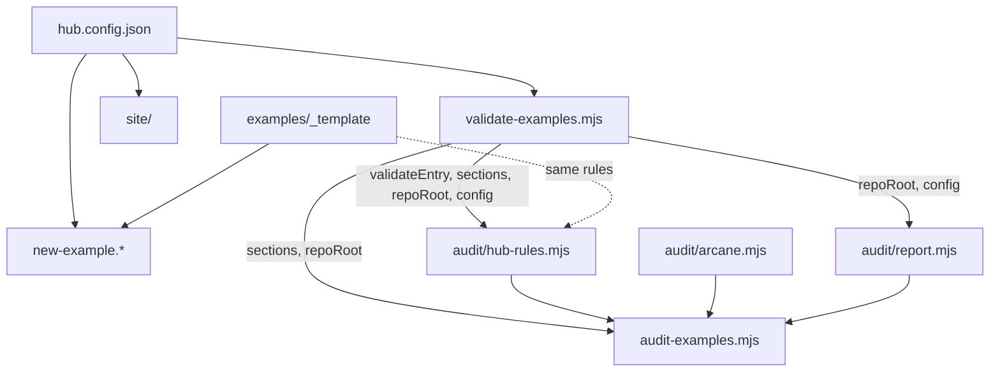

# Systems

The repo's tooling is small: four zero-dependency Node scripts under `scripts/`, a six-module audit pipeline under `scripts/audit/`, and an Astro site under `site/`. All of it was written by one person (ekwuno) between Jul and Sep 2026. Every system reads the same two files per entry, `example.json` and `README.md`, plus `hub.config.json`.

| System | What it does | Entry point | Runs in |
| --- | --- | --- | --- |
| [Validator](validator.md) | Checks every `example.json` against `hub.config.json` and keeps the two README index tables in sync | `scripts/validate-examples.mjs` | `.github/workflows/validate-examples.yml` on every PR, and locally |
| [Scaffolder](scaffolder.md) | Copies `examples/_template/` into a new kebab-case folder and fills in title and type | `scripts/new-example.mjs`, `.sh`, `.ps1` | Locally only |
| [Audit](audit/index.md) | Runs Arcane Auditor plus seven hub rules on changed folders, applies a severity policy, and comments on the PR | `scripts/audit-examples.mjs` | `.github/workflows/audit-examples.yml` + `.github/workflows/audit-comment.yml`, and locally |
| [Gallery](gallery.md) | Static site that lists every entry with filters, renders each README, and offers zip downloads | `site/src/pages/index.astro` | `.github/workflows/deploy-gallery.yml` on push to `main` |

## How they depend on each other

`scripts/validate-examples.mjs` is the shared base. It exports `repoRoot`, `config`, `sections`, `validateEntry`, `validateAll`, and `tablesInSync`, and its comment warns that `validateEntry` is reused by the audit, "so keep it free of side effects." The gallery does not import from `scripts/`; it repeats the section defaults in `site/src/lib/examples.js`.

## Shared conventions

- **No dependencies.** Each script header says "Zero dependencies" and needs only Node 20. The only npm install in the repo is for `site/`.
- **Kebab-case folder names.** The regex `^[a-z0-9][a-z0-9-]*$` appears in `scripts/new-example.mjs`, `scripts/new-example.sh`, `scripts/new-example.ps1`, and `scripts/audit/hub-rules.mjs` (where a comment says "same rule as scripts/new-example.mjs").
- **Folders starting with `_` or `.` are not entries.** The validator, audit, diff helper, gallery loader, and zip builder all skip them.
- **Exit codes mean something.** The audit uses 0 (clean or advisory), 1 (blocking findings), 2 (usage), 3 (tooling failure).

See [Patterns and conventions](../how-to-contribute/patterns-and-conventions.md) for the coding style these share, and [Tooling](../how-to-contribute/tooling.md) for how CI wires them together.
