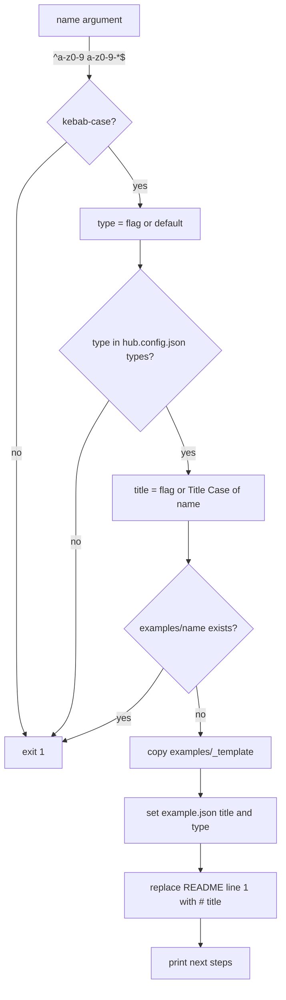

# Scaffolder

Active contributors: ekwuno

## Purpose

The scaffolder creates a new community example by copying `examples/_template/` to `examples/<name>/` and filling in the title and type. It exists in three versions so contributors without Node can still use it: `scripts/new-example.mjs` (Node), `scripts/new-example.sh` (macOS and Linux), and `scripts/new-example.ps1` (Windows). The shell and PowerShell versions were added in Jul 2026 (commit `2142079`, followed by a refactor in `f980a44`).

## Directory layout

```text
scripts/
├── new-example.mjs     # Node version (72 lines)
├── new-example.sh      # Bash version, no Node or jq needed
└── new-example.ps1     # PowerShell version
examples/_template/
├── README.md           # four required sections + a "Fill in example.json" section
└── example.json        # title "My Example", type "Extend App", source "community"
```

## Usage

```bash
node scripts/new-example.mjs my-example-name
node scripts/new-example.mjs my-example-name --type "Orchestration" --title "My Example"

./scripts/new-example.sh my-example-name --type "Agent Skill"

powershell -ExecutionPolicy Bypass -File scripts\new-example.ps1 my-example-name -Type "Orchestration"
```

## How it works



All three versions follow the same steps. They differ in how they read `hub.config.json` and edit files:

| Step | `scripts/new-example.mjs` | `scripts/new-example.sh` | `new-example.ps1` |
| --- | --- | --- | --- |
| Read types | `JSON.parse` | `awk '/"types": \[/,/\]/'` then `grep -o` (no jq) | `ConvertFrom-Json` |
| Default type | `config.types[0]` | second quoted string in the types block (the first is `"types"` itself) | `$config.types[0]` |
| Title check | none | `^[A-Za-z0-9][A-Za-z0-9 .,()-]*$`, because the title is spliced into a `sed` expression | none |
| Edit `example.json` | parse, set fields, `JSON.stringify(meta, null, 2)` | `sed` replace of `"title": "My Example"` and `"type": "Extend App"` into a temp file, then `mv` | `ConvertTo-Json -Depth 5`, `Set-Content -Encoding UTF8` |
| Next steps text | includes "Run: node scripts/validate-examples.mjs" | "Open a pull request. CI runs validation for you." | same as `.sh` |

All three default to `Extend App`, the first entry in `hub.config.json` `types`. The shell version writes through a temp file because "BSD and GNU sed disagree about -i" (comment in `scripts/new-example.sh`).

## What the scaffolder does not do

It only sets `title` and `type`. The new `example.json` still has the template description "One or two sentences about what this example shows.", and the README still has the template paragraphs and the "Fill in example.json (delete this section before submitting)" section. All of these strings are in `TEMPLATE_STRINGS` in `scripts/audit/hub-rules.mjs`, so a freshly scaffolded folder fails the audit with `HubTemplateBoilerplateRule` ACTION findings until the contributor replaces them. The validator, by contrast, passes as soon as the folder exists, because the template description is non-empty. This split is deliberate: the validator checks the contract, and the audit checks that the contributor did the writing.

It also only writes to `examples/`. There is no scaffolder for `catalog/`; catalog apps arrive as exported app source.

## Integration points

- Reads `hub.config.json` `types`.
- Copies `examples/_template/`, which the validator and gallery skip because the name starts with `_`.
- Shares its folder-name regex with `HubFolderKebabCaseRule` in `scripts/audit/hub-rules.mjs`.

## Entry points for modification

Change the template first (`examples/_template/README.md` and `example.json`), since all three scripts copy it. If you change the template's placeholder title or type strings, update the `sed` patterns in `scripts/new-example.sh` and the `TEMPLATE_STRINGS` list in `scripts/audit/hub-rules.mjs` to match. A new flag has to be added to all three scripts.

## Key source files

| File | Purpose |
| --- | --- |
| `scripts/new-example.mjs` | Node scaffolder |
| `scripts/new-example.sh` | Bash scaffolder |
| `scripts/new-example.ps1` | PowerShell scaffolder |
| `examples/_template/README.md` | README skeleton with the four audited sections |
| `examples/_template/example.json` | Metadata skeleton |

## Related pages

- [Contribution flow](../features/contribution-flow.md)
- [Template](../examples/template.md)
- [Pitfalls](../background/pitfalls.md)
