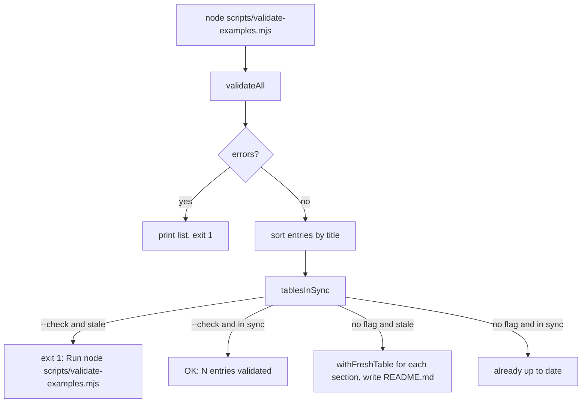

# Validator

Active contributors: ekwuno

## Purpose

`scripts/validate-examples.mjs` checks every entry in `catalog/` and `examples/` and keeps the two index tables in the root `README.md` up to date. It is the "Validate examples" required check on `main`, and it is also the shared library the audit imports for paths, config, and per-entry validation.

## Directory layout

```text
scripts/validate-examples.mjs        # 209 lines, the whole system
hub.config.json                      # approved types, components, products
README.md                            # <!-- catalog:start/end --> and <!-- examples:start/end --> tables
.github/workflows/validate-examples.yml
```

## Key abstractions

| Symbol | Description |
| --- | --- |
| `repoRoot` | Absolute repo root, derived from the script's own location |
| `config` | Parsed `hub.config.json` |
| `sections` | `[{ dir: "catalog", markers: "catalog", defaultSource: "workday" }, { dir: "examples", markers: "examples", defaultSource: "community" }]` |
| `validateEntry(sectionDir, name)` | Returns `{ errors, entry }` for one folder; `entry` is `null` when metadata is unusable |
| `validateAll()` | Walks both sections, skipping `_*`, `.*`, and non-directories |
| `tablesInSync(entries, readme)` | Compares README table rows by cell content, not formatting |
| `rowsFor`, `tableRows`, `withFreshTable`, `markerPositions` | Table generation and parsing helpers (not exported) |

All symbols live in `scripts/validate-examples.mjs`.

## What it checks

For each folder, `validateEntry()` reports:

| Check | Error text (abbreviated) |
| --- | --- |
| `README.md` exists | `missing README.md` |
| `example.json` exists and parses | `missing example.json` / `is not valid JSON` |
| `title`, `description`, `type` present | `example.json needs a "title"` |
| `type` in `config.types` | `"X" is not an approved type. Pick from: ...` |
| Each `components` entry in `config.components` | `is not an approved component` |
| Each `products` entry in `config.products` | `is not an approved product` |
| `tutorial` is empty or starts with `https://` | `"tutorial" should be an https link` |
| `source` is `workday`, `community`, or absent | `"source" must be "workday" or "community"` |
| No `"source": "community"` in `catalog/` | `catalog apps are Workday-maintained ...` |

`components` and `products` go through `asList()`, so a single string is accepted as a one-item list.

## How it works



Each section's table sits between HTML comment markers in `README.md`, for example `<!-- catalog:start -->` and `<!-- catalog:end -->`. A row is ``| [`id`](section/id) | description | type |``, sorted by title. The comparison ignores whitespace and the header and separator rows, so Prettier can reflow the table without failing CI. If a marker is missing, the script exits with `README.md is missing the ... markers.`

The script only runs `main()` when executed directly (`isMain`), so importing it from the audit has no side effects.

Running it today prints `OK: 46 entries validated, README tables in sync.`

## Integration points

- **Audit:** `scripts/audit/hub-rules.mjs` calls `validateEntry()` and turns each error into a `HubExampleJsonRule` finding. `scripts/audit-examples.mjs`, `scripts/audit/diff.mjs`, `scripts/audit/arcane.mjs`, and `scripts/audit/report.mjs` import `repoRoot`, `sections`, or `config`. See [Audit](audit/index.md).
- **CI:** `.github/workflows/validate-examples.yml` runs `node scripts/validate-examples.mjs --check` on every `pull_request` with Node 20.
- **Gallery:** does not import the validator, but repeats the same section defaults in `site/src/lib/examples.js`. See [Source badges and support](../features/source-badges-and-support.md).

## Entry points for modification

To add a new required field, add a check in `validateEntry()`; the audit will pick it up as a `HubExampleJsonRule` finding with no extra work. To approve a new type, component, or product, edit `hub.config.json` only. To add a third section (say `labs/`), add it to `sections` here, then update `site/src/lib/examples.js`, `site/scripts/build-zips.mjs`, the `PATH_RE` in `scripts/audit/post-review.mjs`, and add markers to `README.md`.

## Key source files

| File | Purpose |
| --- | --- |
| `scripts/validate-examples.mjs` | Validation, README table sync, shared exports |
| `hub.config.json` | Approved vocabularies |
| `README.md` | The two generated tables |
| `.github/workflows/validate-examples.yml` | CI check |

## Related pages

- [Example entry](../primitives/example-entry.md) for the `example.json` fields
- [Configuration](../reference/configuration.md) for `hub.config.json`
- [Testing](../how-to-contribute/testing.md)
